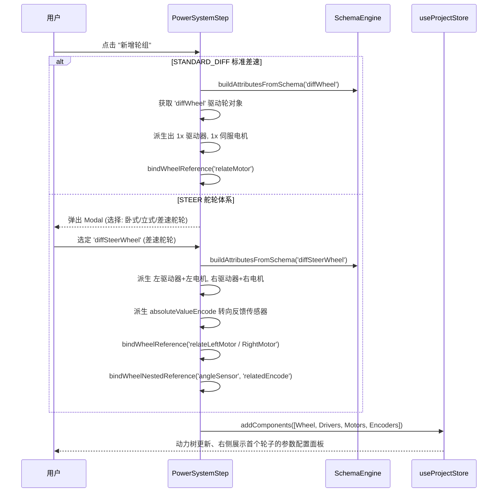
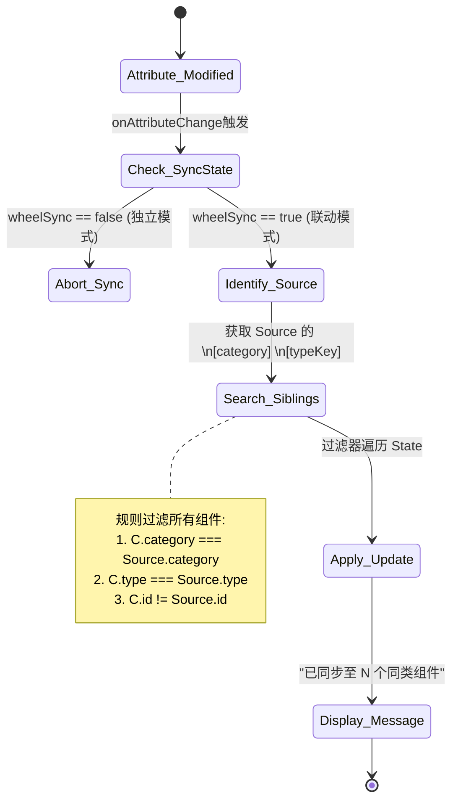

# AMR Studio V4 动态能力系统逻辑图

> 文档编号: 03  
> 日期: 2026-03-28  
> 描述: 前端 Schema 驱动机制及动力组件联动同步逻辑视图  

## 1. 核心架构流转图

描述了 AMR 官方 `ModuleLibrary` 模版到实际用户界面的流转关系。所有动态界面的渲染核心均由 **SchemaEngine** 解析和注入工程约束而成，不含硬编码界面逻辑。

```mermaid
flowchart TD
    %% Define external sources
    subTypeJSON[("ModuleLibrary \nPrivateAttribute.json \n(Single Source of Truth)")]
    
    %% Engine components
    subgraph Core Engine [Schema Engine]
        SchemaAPI(("buildAttributesFromSchema()"))
        EngConst{"getEngineeringConstraints() \n(拦截器)"}
        Transform("[transformElement()]\n类型转换与映射")
    end
    
    %% UI Components
    subgraph UI Rendering [Wizard UI layer]
        SmartForm(("SmartForm / ComponentPropertyPanel"))
        InputWidget["InputNumber / Switch\nSelect / Space.Compact"]
        RelSelector["DATA_FIXED_E Component Selector"]
    end
    
    %% Data / State
    subgraph State Management [Zustand Store]
        Store["useProjectStore()"]
        ComponentsData[("config.components\n(AMR Project State)")]
        SyncHook{"syncAttributeToSiblings() \n(参数联动)"}
    end

    %% Flow
    subTypeJSON -.-> |Vite eager import| SchemaAPI
    SchemaAPI --> EngConst
    EngConst -->|覆盖默认值,\n隐藏非法枚举,\n反转boolHide| Transform
    Transform -->|生成的 UI 类型 \nSmartAttribute[]| SmartForm
    
    SmartForm --> |Render| InputWidget
    SmartForm --> |Path Mapping| RelSelector
    
    InputWidget -- "onAttributeChange" --> SyncHook
    RelSelector -- "onAttributeChange" --> SyncHook
    
    SyncHook -->|更新源组件| Store
    SyncHook -->|遍历兄弟组件应用| Store
    Store --> ComponentsData
```

## 2. 轮组装配与多级子节点衍生逻辑 (doCreateWheel)

演示在 `PowerSystemStep` 中，选择不同的“底盘/轮组”模式后，系统内部如何根据物理形态，派生整条动力链。



## 3. 参数联动原理与判定规则

当在一个拥有数十个属性的轮组配置面板中修改了参数（如电机反馈类型的变更或轮径变更），系统如何实现 `wheelSync` 自动推断并全量同步：


