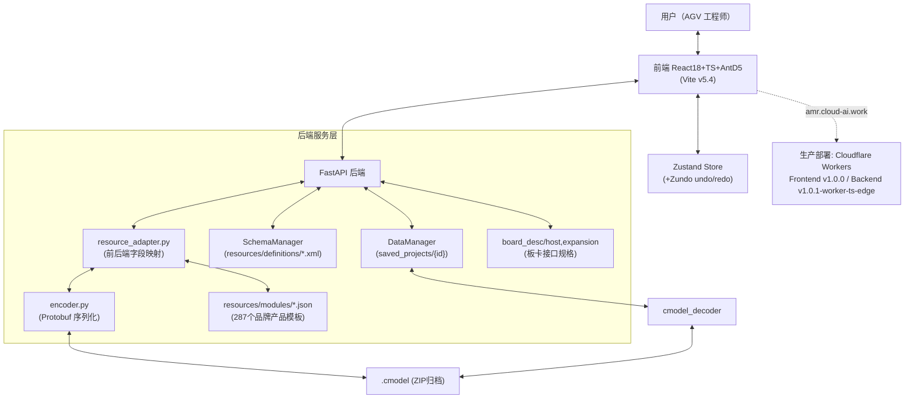
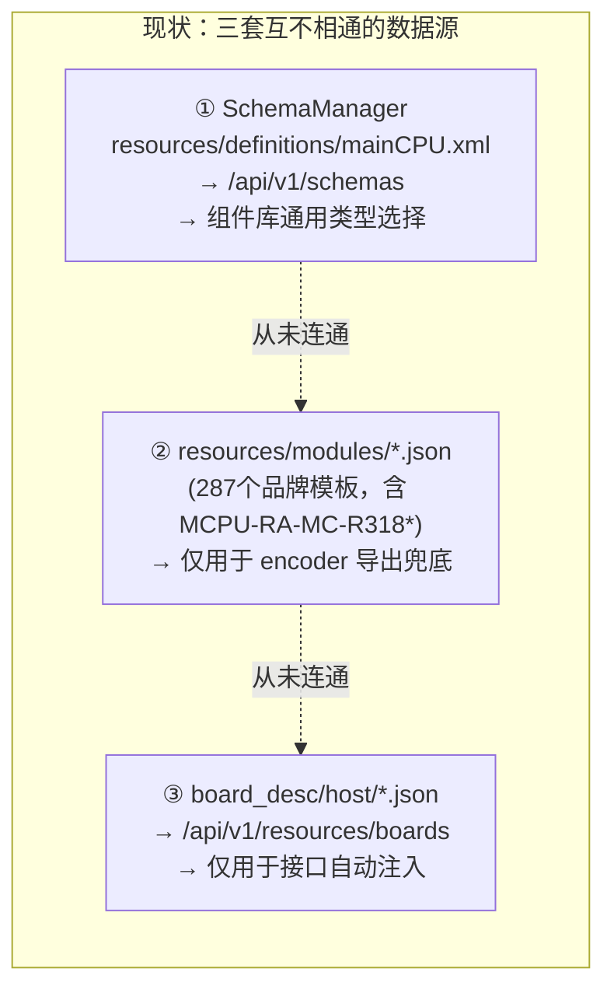

# AMR Studio V4 — 总体设计 (System Architecture Design)

> 文档编号: ARCH-20260913-03
> 日期: 2026-09-13
> 上游依据: `requirements/20260913_01_需求详细规格书.md`
> 下游配套: `design/20260913_02_后端设计.md`、`design/20260913_03_前端界面设计.md`、`design/20260913_04_控制流设计.md`、`design/20260913_05_数据流设计.md`

---

## 1. 系统定位与总体架构

AMR Studio V4 是工业级 AMR/AGV 整车电子电气配置平台，采用前后端分离 + Schema-First 架构：

技术栈（已核实与 `issue_tracker/progress_report.md` 一致）：
- 前端：Vite 5.4 + React 18 + TypeScript（零 tsc 错误目标）+ Ant Design 5.x（深色主题 tokens）+ Zustand + Zundo。
- 后端：Python FastAPI，核心目录 `src/backend/{core, skills_v2, resources, schemas}`；协议层 Proto3（`controller_model_{comp_desc,abi_desc,abi_set}.proto`，已生成 `.pb.cc/.pb.h`，Python 端通过 `protoc` 生成对应绑定）。
- 本地开发：`python3 start.py` 编排端口 8002（后端）/ 3001（前端）。
- 生产：Cloudflare Workers（`/compile` 端点实现为 `runtime: "cloudflare-worker-typescript"`）。

---

## 2. 领域架构原则（本项目的"宪法"）

以下 5 条原则来自本次四舵轮 AGV 建模任务的原始治理要求，是驱动本文档所有设计决策的最高约束。**当前系统对每条原则的强制程度不同**，本节逐条给出现状评估：

| # | 原则 | 当前强制程度 | 差距 |
|---|---|---|---|
| 1 | 每台车必须具备 1 个主控制器 + 至少 1 个 IO 扩展模块（8进10出规格） | ❌ 无自动化校验；审计规则未覆盖"整车必须存在 mainCPU 类别组件"这一条 | 需在 `AuditStep` 新增规则（见 §6） |
| 2 | 最小组件集：底盘、轮组（驱动+电机+编码器）、传感器、电池、按钮（急停等）、灯带 | ⚠️ 部分强制（底盘/轮组因 `doCreateWheel` 级联衍生规则被动满足，传感器/电池/按钮/灯带无强制清单校验） | 需在审计中新增"最小组件集清单校验"规则 |
| 3 | 电气组件必须具备真实电气连接/配置（CAN 总线 ID、网络 IP） | ⚠️ 部分：IP/CAN 节点 ID 字段存在且可配置，但驱动器缺少 CAN 接口定义（REQ-CL-05），导致该原则在"驱动器"这一类组件上事实不可达 | 见《后端设计》§4、《需求规格书》REQ-CL-05 |
| 4 | 主控通过 CAN3 使用 UCAN 协议连接 IO 扩展模块 | ❌ 无协议匹配校验，仅端口层面可连线，未校验"协议是否为 UCAN"“端口是否为 CAN3” | 见 REQ-WR-02 |
| 5 | 驱动器通过 CAN2 使用 CANopen 协议连接主控 | ❌ 同上，且驱动器本身接口字段缺失（原则3、5 共享同一根因） | 见 REQ-CL-05 / REQ-WR-02 |

**架构结论**：原则 1/2 属于"整车级完整性校验"，原则 3/4/5 属于"连线级协议校验"。当前审计引擎（`AuditStep.tsx`）只做了字段边界校验（数值上下限、必填），完全没有"整车拓扑完整性"与"连线协议匹配"两类规则。这是本次总体设计新增的架构能力缺口，建议纳入《控制流设计》的审计引擎扩展方案。

---

## 3. 模型文件体系（三层文件形态）

沿用并确认 `design/System_Architecture_And_API_Design.md` 的既有描述（本次未发现需要修正之处，仅做归并）：

| 层 | 文件 | 特点 |
|---|---|---|
| 归档层 | `.cmodel`（ZIP） | 工业级发布格式，供下位机直接加载，可含签名/CAD索引 |
| 二进制层 | `.model`（Protobuf） | `CompDesc.model`（整车物理蓝图）、`AbiSet.model`（能力集）、`FuncDesc.model`（业务功能表，当前多数项目为空模板复制） |
| 可读层 | `.json` | 前后端"握手"载体，`general_attr`/`private_attr`/`interface_params`/`interface_ability` 四段式骨架 |

本次实操导出的真实产物已验证该结构：`amr_quad_steer_4000x2000_packed.cmodel` 解压后为 `CompDesc.model`(59857B) + `AbiSet.model`(1090B) + `ModelFileDesc.json`(314B)，与设计文档描述一致（注：本项目导出物未包含独立的 `FuncDesc.model`，与 `detailed_design.md §4.1` 描述的容器结构存在细节出入，需在《数据流设计》中说明实际观测结果）。

---

## 4. 18 类硬件大类与 34 种接口类型

沿用 `specifications/ENGINEERING_CONSTRAINTS.md §18.2/§18.3` 的既定分类，不重复定义。前端 `types.ts` 中的 `MainModuleType` 枚举当前存在 `IO_BOARD`、`MOTOR`、`VISUAL` 等非标准别名，中期目标是清理或注释为标准 18 类的别名映射（§22），本设计将其列为技术债务而非新架构决策。

---

## 5. 关键架构问题：三套并行的"主控制器"数据源（本次核心发现）

详见《需求详细规格书》§0。本节给出架构级的统一方案建议：

**候选方案 A（推荐）**：扩展 `SchemaManager.load_all()`，使其在解析 `resources/definitions/*.xml` 得到的"类型级"schema 基础上，额外扫描 `resources/modules/*.json` 中同 `category` 的品牌产品文件，作为该类型下的"具体型号"子选项返回给 `/api/v1/schemas`；`board_desc` 数据继续保留为该型号被选中后的接口详情来源，通过型号 key（如 `RA-MC-R318AD`）建立索引关联。此方案只改后端聚合逻辑，前端 `ComponentLibraryStep.tsx` 现有的 `libraryData` 消费方式基本不变。

**候选方案 B**：新增独立 `GET /api/v1/resources/products?category=MAINCPU` 端点，直接读 `resources/modules/*.json` 返回品牌产品列表，前端"组件库"页在现有"类型选择"下拉之后追加"型号选择"下拉。此方案改动面更小、风险更低，但引入第四个数据读取路径，长期维护性弱于方案 A。

两方案的详细接口设计见《后端设计》§4；本文档只做架构级选型建议：**采用方案 A**，因为它是把三套数据源收敛为"一套注册表、三层细化"的模型，符合 `audits/20260331_DESIGN_OPTIMIZATION_PROPOSAL.md` 中"O-1: 建立模板索引注册表"的既有优化方向（该提案设计的 `TemplateRegistry` 已经具备按 `mainModuleType`/`subModuleType` 建索引的能力，本次只需将其索引维度从 2 层扩展为 3 层：`mainType → subType → 品牌型号`）。

---

## 6. 审计引擎架构扩展建议

当前 `AuditStep.tsx` 的规则集只做"单字段边界校验"。为满足 §2 中原则 1/2/4/5 的强制化需求，建议在不改变现有 ERROR/WARNING 分级哲学（`REQ-AU-01`）的前提下，新增两类规则：

1. **整车完整性规则（Vehicle-level）**：输入为整棵组件树，规则形如"树中必须存在 ≥1 个 `category=MAINCPU` 的组件"“必须存在 ≥1 个 `category=BATTERY` 的组件”。这类规则与现有"单组件字段校验"规则在执行时机上不同，需要在审计引擎中新增一个"整车前置校验"阶段，在逐组件校验之前执行。
2. **拓扑协议匹配规则（Topology-level）**：输入为连线拓扑图（哪个 UUID 的哪个端口连到哪个 UUID 的哪个端口），规则形如"若目标组件 `category=DRIVER`，则连接必须挂载在主控 CAN2 端口，且协议标注为 CANopen"。这类规则依赖 REQ-WR-01（总线主从拓扑可视化）先行落地，因为协议匹配校验的前提是系统已经知道"哪个端口是 CAN2"。

设计上建议将上述两类规则实现为独立的 `VehicleLevelRule[]` 与 `TopologyRule[]` 数组，与现有字段级规则并列驱动同一个审计结果列表，复用现有的 ERROR/WARNING 展示 UI，不新建 UI 组件。

---

## 7. 部署视图

| 环境 | 前端 | 后端 | 备注 |
|---|---|---|---|
| 本地开发 | `localhost:3001` | `localhost:8002` | `python3 start.py` 一键启动 |
| 生产 (amr.cloud-ai.work) | Cloudflare Workers, Frontend v1.0.0 | Cloudflare Workers, Backend v1.0.1-worker-ts / worker-ts-edge | `/compile` 为 `cloudflare-worker-typescript` runtime |

**已知风险**：本地 FastAPI（Python）与生产 Cloudflare Worker（TypeScript）是两套独立实现，`/compile` 端点在两个环境下的错误处理路径可能不一致（REQ-EX-01 复现于生产环境）。总体设计层面建议：两套后端实现之间应有一份共享的"契约测试"（对同一批测试用例分别打到本地 FastAPI 与生产 Worker，断言响应结构一致），避免"本地测试通过、生产环境行为不同"的分裂，这是当前架构里唯一的双实现来源，长期看应评估是否收敛为一套实现 + 两种部署目标，而非两套独立代码。

---

## 8. 非功能性架构目标

对齐《需求详细规格书》§5：数据保真（Bit-Perfect round-trip）、Schema 驱动、原子化 PATCH、可用性（无障碍操作/表单健壮性/持久化可靠性）、UI 主题合规。架构上这些目标分别由：
- 数据保真 → Protobuf 强类型 + `FIELD_REGISTRY` 模式（后端）+ round-trip 测试（见开发规范 §7）保障；
- Schema 驱动 → `SchemaEngine.ts`（前端）+ `SchemaManager`/`resource_adapter.py`（后端）双侧模板加载保障；
- 原子化 PATCH → 现有 `PATCH /api/v1/models/{id}/components/{uuid}` 契约保障，无需架构变更；
- 可用性四项 → 均为前端交互层缺陷，不涉及架构变更，详见《前端界面设计》。
