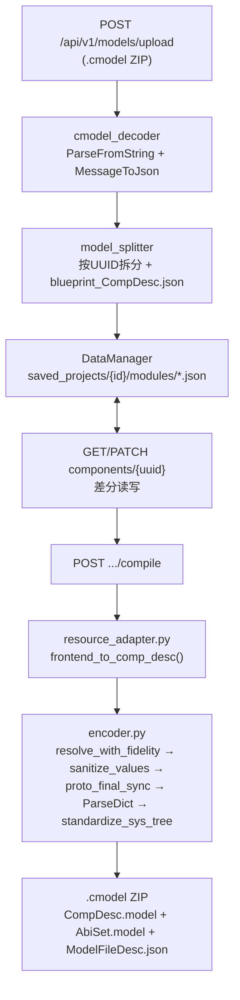

# AMR Studio V4 — 后端设计 (Backend Design)

> 文档编号: BE-20260913-04
> 日期: 2026-09-13
> 上游: `requirements/20260913_01_需求详细规格书.md`、`design/20260913_03_总体设计.md`
> 代码基线: commit `be92fa68`（`main`）附近，`src/backend/` 实测行数：`main.py`(390)、`resource_adapter.py`(348)、`schema_builder.py`(207)、`schemas/api.py`(200)、`mapping_registry.py`(186)、`data_manager.py`(175)、`schema_manager.py`(139)

---

## 1. 服务分层与目录结构（实测）

```
src/backend/
├── main.py                 # FastAPI 入口，13 个路由（见 §2）
├── core/
│   ├── schema_manager.py   # 类型级 Schema 加载器（扫描 resources/definitions/*.xml）
│   ├── schema_builder.py   # Schema → 前端可用结构的构建逻辑
│   ├── resource_adapter.py # 前后端字段映射 / 缺省值补全 / CATEGORY_TO_SUBSYS 等映射表
│   ├── data_manager.py     # 项目文件持久化（saved_projects/{id}）
│   ├── mapping_registry.py # 映射注册表
│   ├── model_parser.py / protobuf_engine.py / protobuf_navigator.py  # Protobuf 读写辅助
├── skills_v2/
│   ├── cmodel_decoder/     # .cmodel → JSON
│   ├── model_splitter/     # JSON → 按 UUID 拆分的原子模块 + blueprint
│   ├── cmodel_encoder/     # JSON（合并后）→ .cmodel
│   └── schemas_pb/         # Protobuf Python 绑定
├── skills/                 # 旧版技能（cmodel_unzip / model_tree_analyzer / model_deserializer），Refactoring_Design_Plan.md 中已规划向 skills_v2 收敛
├── resources/
│   ├── definitions/        # 18 个 moduleType XML（简化 Schema，供 SchemaManager）
│   └── modules/            # 287 个品牌产品 JSON+XML（供 resource_adapter 缺省值补全）
├── schemas/api.py          # 另一套 Schema API（与 core/schema_manager.py 需确认是否重复，见 §6 风险项）
├── templates/               # FuncDesc 等模板复制源
├── saved_projects/{id}/    # 每项目独立沙箱，含 modules/ 与 .bak
└── user_saves/             # 用户"保存的项目"列表（ISS-010）
```

**架构说明**：`resources/definitions/*.xml` 与 `specifications/ModuleLibrary/Aggregated/*.xml`（CLAUDE.md/ENGINEERING_CONSTRAINTS.md §18 中反复强调的"聚合 XML Source of Truth"）是**两套不同的文件**，前者是 `SchemaManager` 实际读取的简化格式（`<moduleType key= category= label=>`），后者是 `specifications/` 目录下更完整的聚合体系（`PrivateAttributes.xml`/`InterfaceSpecs.xml`/`ModuleConfigs.xml`/`BoardDescriptions.xml`）。这一并行现状是《总体设计》§5 所述架构问题的直接代码证据，本设计文档所有涉及"Schema 来源"的描述均以**实测的 `resources/definitions/`** 为准，不得混淆为 `specifications/ModuleLibrary/Aggregated/`。

---

## 2. API 路由清单（实测自 `main.py`）

| 方法 | 路径 | 用途 | 对应需求 |
|---|---|---|---|
| GET | `/api/v1/system/version` | 版本查询 | — |
| POST | `/api/v1/models/init-sandbox` | 初始化沙箱环境 | — |
| POST | `/api/v1/models/upload` | 上传 `.cmodel`，解码+拆分 | 数据流 Import |
| GET | `/api/v1/models/{project_id}/components/{module_uuid}` | 获取单组件详情 | REQ-NF-03 |
| PATCH | `/api/v1/models/{project_id}/components/{module_uuid}` | 原子更新单组件 | REQ-NF-03 |
| GET | `/api/v1/models/{project_id}/abilities` | 获取能力集 | — |
| PATCH | `/api/v1/models/{project_id}/abilities` | 更新能力集 | REQ-AB-01 |
| POST | `/api/v1/models/{project_id}/compile` | 编译导出 `.cmodel` | REQ-EX-01/02 |
| GET | `/api/v1/resources/boards` | 列出 `board_desc/host/*.json` 板卡（id/name/desc/board_type） | 见 §4，本次发现的第③数据源入口 |
| GET | `/api/v1/projects/saved-list` | 已保存项目列表 | ISS-010 |
| POST | `/api/v1/projects/save` | 保存项目 | ISS-010 |
| GET | `/api/v1/projects/load/{name}` | 按名称加载项目 | ISS-010 |
| GET | `/api/v1/schemas` | 类型级 Schema 注册表（`SchemaManager.get_registry()`） | 见 §4，第①数据源入口 |

**已实测的容错行为**：`list_boards_api()` 对单个损坏板卡文件已有 `try/except` + `logger.warning` 兜底（注释标记 `§AUDIT-FIX(2026-09)`，说明此前是裸 `except: pass` 会静默丢失整个板卡且无痕迹，已修复），这是一个值得在其余遍历型端点（如 `/api/v1/schemas` 对 `resources/definitions/*.xml` 的加载、`resource_adapter.py` 对 `resources/modules/*.json` 的加载）中复用的容错模式，建议统一封装为 `safe_load_json(path, logger)` 工具函数，而不是每处重复实现。

---

## 3. CModel 编码/解码流水线

沿用并确认 `docs/ARCHITECTURE_DESIGN_AND_TECH_DEBT.md §2.2.2` 的既有描述，流水线步骤与实际路由映射如下：



`encoder.py` 五个关键步骤职责（沿用 `docs/ARCHITECTURE_DESIGN_AND_TECH_DEBT.md §2.2.2` 已核实的描述，不重复展开）：`resolve_with_fidelity()`（$ref 解析）→ `sanitize_values()`（类型清洗）→ `proto_final_sync()`（camelCase→snake_case 归一化，防止 `ParseDict` 静默丢字段）→ `ParseDict()`（JSON→Protobuf Message）→ `standardize_sys_tree()`（模块树扁平化 + `moduleSys`/`subSysType` 规则落地）。

---

## 4. REQ-CL-01 落地设计：主控制器目录统一（本文档核心新增设计）

对应《总体设计》§5 的候选方案 A。具体改造点：

### 4.1 `SchemaManager` 扩展

```python
# core/schema_manager.py（改造示意，非最终代码）
class SchemaManager:
    def __init__(self, definitions_path: str, modules_path: str):
        self.definitions_path = Path(definitions_path)
        self.modules_path = Path(modules_path)   # 新增：resources/modules/
        self.schemas: Dict[str, Any] = {}
        self.load_all()

    def load_all(self):
        new_schemas = {}
        for xml_file in self.definitions_path.glob("*.xml"):
            schema = self._parse_xml(xml_file)
            if schema and "key" in schema:
                # 新增步骤：为该 category 附加品牌型号清单
                schema["brandedProducts"] = self._scan_branded_products(schema["category"])
                new_schemas[schema["key"]] = schema
        self.schemas = new_schemas

    def _scan_branded_products(self, category: str) -> List[Dict[str, Any]]:
        """扫描 resources/modules/*.json，返回与 category 匹配的品牌产品清单。
        匹配依据：模块 JSON 内 generalAttr.mainModuleType.comboType.typeKey == category
        （禁止用文件名子串匹配，遵循 ENGINEERING_CONSTRAINTS §13 的"名称启发式禁令"）。
        """
        products = []
        for f in self.modules_path.glob("*.json"):
            try:
                data = json.loads(f.read_text(encoding="utf-8"))
                type_key = data.get("generalAttr", {}).get("mainModuleType", {}) \
                               .get("comboType", {}).get("typeKey")
                if type_key == category:
                    products.append({
                        "productId": f.stem,
                        "name": data.get("generalAttr", {}).get("moduleDesc", {}).get("stringValue", f.stem),
                        "sourceFile": str(f.name),
                    })
            except Exception as e:
                logger.warning("Skipping unreadable module template %s: %s", f, e)
        return products
```

**注意**：`resources/modules/*.json` 当前的实际字段结构需要在实现前逐文件核实是否确有 `generalAttr.mainModuleType.comboType.typeKey`（部分文件如 `MCPU-RA-MC-R318AT.json` 可能是更早期/不同格式的模板，实现前必须先跑一次结构探测脚本，统计 287 个文件中有多少符合该结构，不符合的需要单独清洗，这一步应作为独立的前置任务，不与本次改造混在一起提交）。

### 4.2 `/api/v1/schemas` 响应结构变更

在现有响应基础上，每个 `category` 条目新增 `brandedProducts` 数组，**不破坏现有字段**（向后兼容，前端未消费该字段时行为不变）：

```json
{
  "MAINCPU": {
    "key": "mainCPU", "category": "MAINCPU", "label": "主控核心",
    "subTypes": [ { "key": "mainCPU", "label": "主控制器" }, { "key": "mainCpu", "label": "通用CPU" } ],
    "brandedProducts": [
      { "productId": "MCPU-RA-MC-R318AT", "name": "R-四代-...", "sourceFile": "MCPU-RA-MC-R318AT.json" },
      { "productId": "MCPU-RA-MC-R318BN", "name": "...", "sourceFile": "MCPU-RA-MC-R318BN.json" },
      { "productId": "MCPU-RA-MC-R349AD-21BH0", "name": "...", "sourceFile": "..." }
    ],
    "privateAttributes": [...],
    "interfaces": [...]
  }
}
```

### 4.3 与 `board_desc`（第③数据源）的关联

`brandedProducts[].productId` 命名建议与 `board_desc/host/*.json` 的顶层 key（如 `RA-MC-R318AD`）保持可映射关系（去掉 `MCPU-` 前缀即可对齐），使前端在用户选中某个 `brandedProduct` 后，能够复用现有的 `GET /api/v1/resources/boards` 结果按 `id` 查找对应板卡接口详情，实现"选品牌型号 → 自动带出真实 ETH/CAN/RS485 接口"的完整链路（对应 ISS-006 的兜底诉求，此前 ISS-006 只解决了"接口注入时机"问题，未解决"型号从哪里选"的上游问题，本设计补齐了这一环）。

### 4.4 REQ-CL-05：驱动器 CAN 接口缺失修复

现状：`subDriver` 组件的私有属性模板中未定义 CAN 接口字段，导致"建立连接"表单选中驱动器为源模块时"源接口"下拉为空。

修复设计：在 `src/backend/resources/definitions/driver.xml`（若不存在则新建）中为 `subDriver` 子类型补充：
```xml
<interfaces>
    <interface key="can_0" type="CAN" label="CAN总线(至主控CAN2)" />
</interfaces>
```
并在 `resource_adapter.py` 的模板缺省值补全逻辑（`enrich_from_templates()`，ENGINEERING_CONSTRAINTS §15）中，确认该字段在组件创建时被正确写入 `interfaceParams`。此修复同时是 REQ-WR-02（CAN2/CANopen 协议校验）的前置依赖——没有接口字段就无从校验协议匹配。

---

## 5. 错误契约设计（REQ-EX-01）

### 5.1 现状问题
生产环境 `/compile`（Cloudflare Worker 实现）在内部抛出未捕获异常时，返回的是 Worker 运行时默认的错误页文案（"A Worker script configured by the website owner threw an unhandled exception..."），直接透传给终端用户；而同一接口的本地 FastAPI 实现在等价请求下能返回 200 成功。

### 5.2 修复设计
统一错误响应契约（本地 FastAPI 与生产 Worker 两侧都要实现）：
```json
{ "error": "COMPILE_FAILED", "detail": "<面向工程师的可读描述>", "node_path": "components/<uuid>/private_attr/...", "stage": "PATCH_SYNC | VALIDATE | SERIALIZE | PACKAGE" }
```
Worker 侧实现要点：在 `/compile` handler 最外层包一层 `try/catch`，catch 块内部按 `stage` 归类已知异常类型（校验失败、序列化失败、打包失败），一律转换为上述结构化 JSON 并以 4xx/5xx 语义合理的状态码返回；只有真正未预期的运行时错误才允许兜底为通用 `INTERNAL_ERROR`，但即便如此也不得把裸异常堆栈文本发给前端——堆栈应写入服务端日志，前端只收到 `{ "error": "INTERNAL_ERROR", "detail": "服务器内部错误，请联系管理员并提供请求ID：<request_id>" }`。

### 5.3 REQ-EX-02：预编译 PATCH 批量同步失败处理
前端在触发 `/compile` 前会对若干组件发起批量 `PATCH`（本次实操中观测到 `PATCH .../components/9923bc16-...→500`）。后端设计要求：批量同步逻辑改为"全部成功才继续，任一失败立即汇总返回"，响应结构：
```json
{ "status": "partial_failure", "failed": [ { "uuid": "9923bc16-...", "error": "..." } ], "succeeded": ["..."] }
```
前端据此在编译前阻断并展示具体失败组件（属于前端设计范畴，此处仅定义后端契约）。

---

## 6. 已识别的后端风险项（需产品/工程确认，非本次直接修复范围）

1. `src/backend/schemas/api.py`（200 行）与 `core/schema_manager.py` 是否是重复/竞争实现？需要一次专门的代码走查确认两者职责边界，避免出现"改了一处 Schema 逻辑，另一处未同步"的隐患。
2. `resources/modules/*.json` 与其同名 `.xml`（如 `MCPU-RA-MC-R318AT.json` / `.xml` 成对出现，287 个文件实为约 143 对）两者是否互为等价表示、由谁生成、谁是权威源，本次未探明，属于遗留问题，建议专项澄清。
3. `src/backend/skills/`（旧版）与 `skills_v2/`（新版）并存，`Refactoring_Design_Plan.md` 已规划收敛方向但未确认当前生产环境实际调用的是哪一版，需要一次调用链路追踪确认，避免文档描述的是新版、生产实际跑的是旧版。
