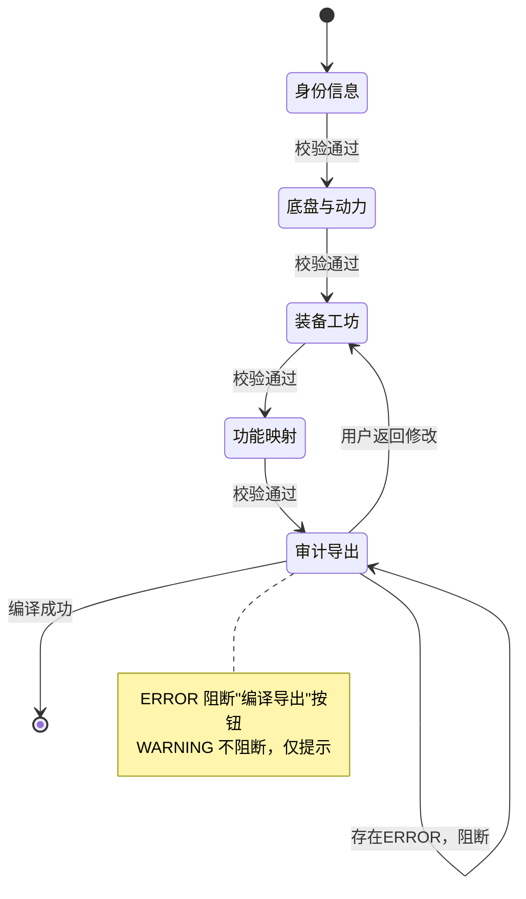
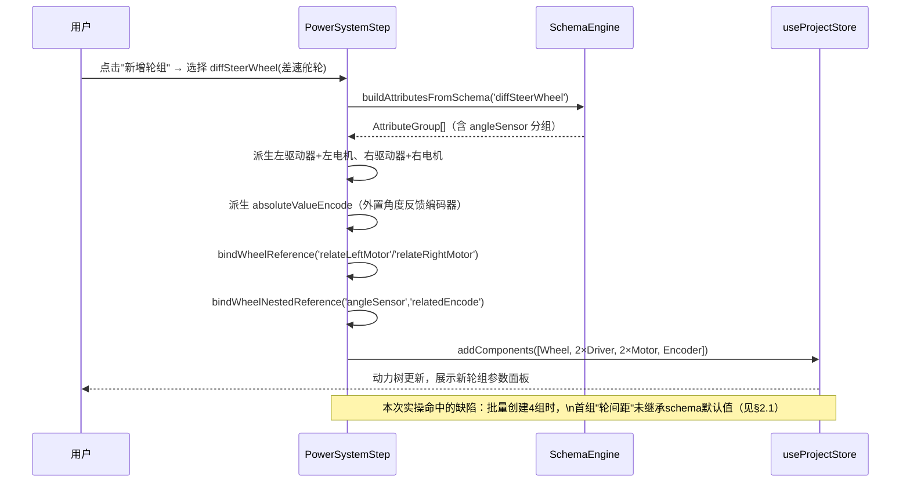
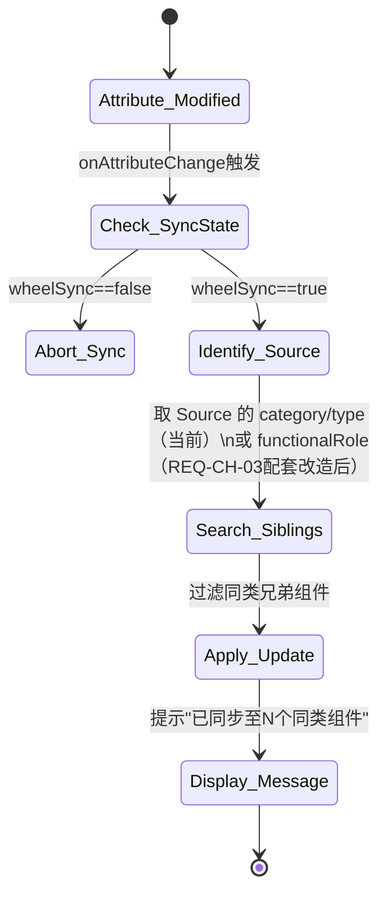
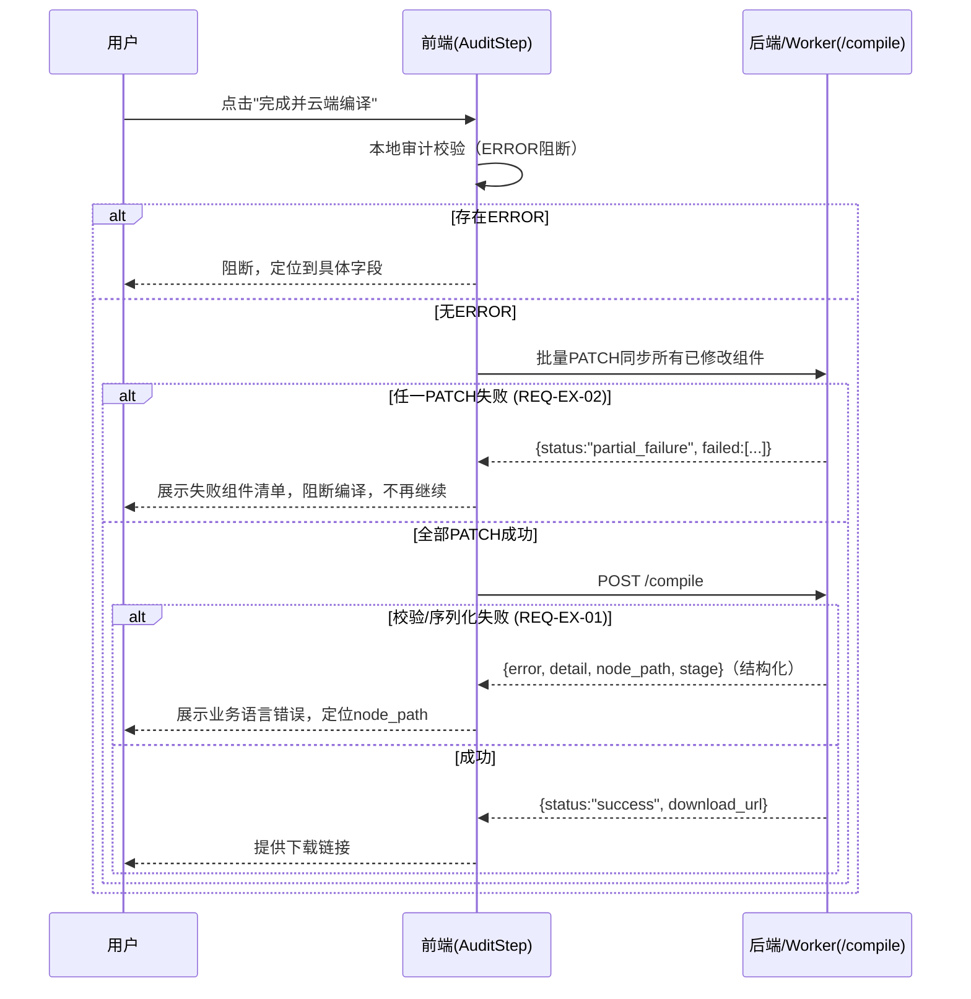
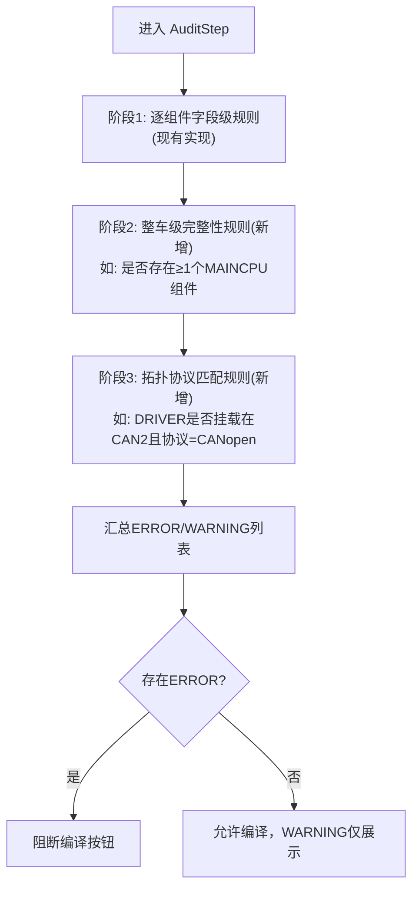

# AMR Studio V4 — 控制流设计 (Control Flow Design)

> 文档编号: CTRL-20260913-06
> 日期: 2026-09-13
> 上游: `requirements/20260913_01_需求详细规格书.md`、`design/20260913_03_总体设计.md`、`design/20260913_04_后端设计.md`

本文档描述系统关键场景下的**控制流转**（谁触发谁、按什么顺序、失败时如何分支），与《数据流设计》互补——数据流关注"数据长什么样、经过哪些形态转换"，本文档关注"动作的先后顺序与分支判断"。

---

## 1. 向导步骤状态机

每一步骤前进时机由该步骤自身的表单校验（必填/边界）控制，**不存在跨步骤的前置校验**（例如"身份信息"步骤不会检查后续"装备工坊"是否已选主控），这是当前设计的既定行为，与《总体设计》§6 提出的"整车级前置校验"是两个不同层面：前者是"能否翻页"，后者是"能否导出"，本次不建议合并两者（翻页时做整车校验会打断用户探索性操作的流畅度）。

---

## 2. 组件创建级联控制流（Topology Auto-Derivation）

### 2.1 REQ-CH-03 根因排查方向（控制流角度）
怀疑点：`doCreateWheel` 在**首次调用**时，`schemaRegistry` 或 `boardInterfaces` 等异步加载的前置资源可能尚未就绪（类似 ISS-006 中"接口注入依赖异步 XML 加载完成"的同类时序问题），导致第 1 组轮组在 schema 默认值填充逻辑执行时拿到的是空/未就绪的 schema，从而 fallback 到硬编码的 0；第 2-4 组因为此时 schema 已加载完成，走的是正常路径。**控制流层面的修复方向**：`doCreateWheel` 的调用应等待 `schemaRegistry` 就绪（例如在 store 中暴露 `isSchemaReady` 标志，UI 层在其为 `false` 时禁用"新增轮组"按钮，而不是允许调用后静默拿到不完整的默认值）。这一方向需要在实现前对照实际代码验证时序假设是否成立，本文档只给出控制流层面的排查方向，不代表最终结论。

---

## 3. 参数联动同步控制流（`syncAttributeToSiblings`）

**ISS-004 关联的控制流缺陷**：当前判定逻辑依赖 `alias` 中文子串"行走"/"转向"，回退路径通过 `relateWalkMotor`/`relateRotMotor` 查找父轮组时只做了一级回溯（电机→驱动器→轮子需两级），且 `getFunctionalRole()` 未处理 `DRIVER` 类别。控制流修复方向（已在 `design/implementation_plan.md` 给出）：改为在创建期由 `doCreateWheel` 直接注入 `functionalRole` 字段，`syncAttributeToSiblings` 优先读取该字段而非运行时推断，中文关键字仅作旧数据兼容 fallback——本文档予以采纳并要求在实现后同步更新《需求详细规格书》REQ-CH-03/《开发规范》§4.4 中对该字段的引用。

---

## 4. 编译导出控制流（含错误分支，对应 REQ-EX-01/02）

**当前实测行为 vs 目标行为**：本次实操中，点击按钮走的是图中"校验/序列化失败"分支，但后端返回的不是结构化 JSON，而是 Worker 运行时的裸异常文案；同一时刻直接对 `/compile` 发起等价请求却落入"成功"分支——说明**按钮触发的请求与直接调用的请求在构造上存在差异**（可能是按钮路径携带了某个此次未同步成功的组件、或请求体缺少某个字段），这是一个需要在实现 REQ-EX-01/02 之前专门追踪一次浏览器网络请求差异（对比"按钮点击"与"直接fetch"两次请求的 payload）才能定位的具体 bug，本文档给出控制流框架，具体请求差异定位建议作为修复前的第一步诊断任务。

---

## 5. 审计规则执行控制流（对应《总体设计》§6 的整车级/拓扑级规则扩展）

三个阶段共用同一个结果列表数据结构和同一套 UI 展示组件，仅规则来源不同，避免为新增两个阶段重新设计一套审计结果展示 UI。

---

## 6. 权限/并发控制流（后端）

- 单组件 PATCH：无锁，依赖"整个父分支覆盖 + 后端 deep_update 智能合并"策略（见《数据流设计》§4），不做乐观锁版本号校验——这是现有设计的既定选择，本次未发现因此产生的实际数据竞争案例，暂不建议引入版本号机制，仅记录为已知的架构简化点。
- 项目级隔离：每个 `project_id` 对应独立的 `saved_projects/{id}/` 目录，跨项目请求天然隔离，无需额外的项目级锁。
