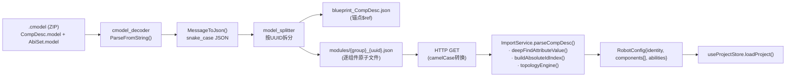
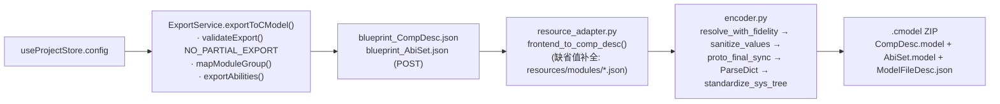
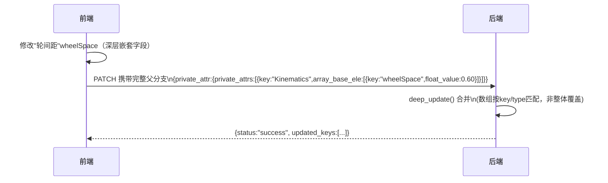
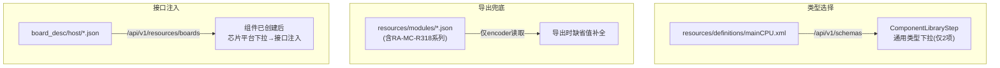
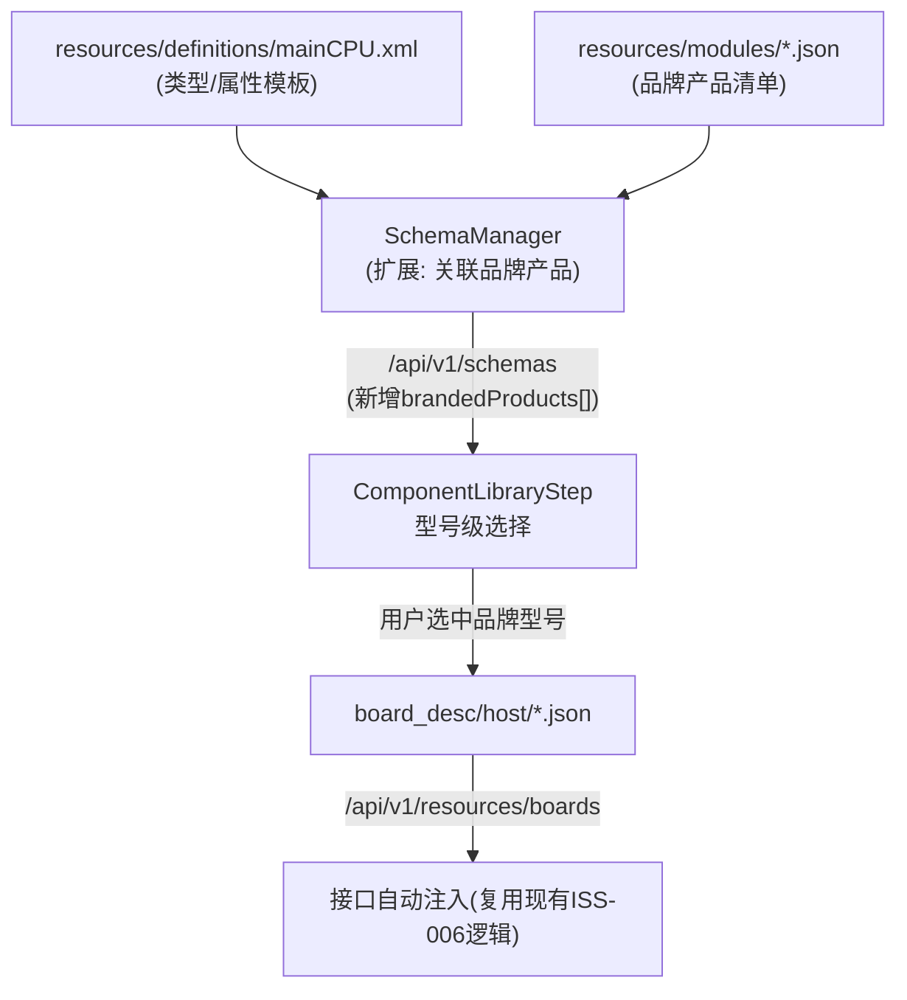

# AMR Studio V4 — 数据流设计 (Data Flow Design)

> 文档编号: DATA-20260913-07
> 日期: 2026-09-13
> 上游: `requirements/20260913_01_需求详细规格书.md`、`design/20260913_04_后端设计.md`
> 本文档所有数据示例均以本次真实交付的四舵轮 AGV 项目（`amr_quad_steer_4000x2000_packed.cmodel`）为例，字段结构基于实际观测，不使用臆造示例。

---

## 1. 导入数据流 (.cmodel → 前端 Store)



**字段名映射（camelCase ↔ snake_case，实测于 `docs/ARCHITECTURE_DESIGN_AND_TECH_DEBT.md §2.2.3`，本次未发现需要修正）**：

| 前端 (camelCase) | Proto (snake_case) |
|---|---|
| `generalAttr` | `general_attr` |
| `privateAttrs` | `private_attrs` |
| `arrayBaseEle` | `array_base_ele` |
| `typeGroups` | `type_groups` |
| `sizeLen` | `size_len` |
| `doubleValue` | `double_value` |

---

## 2. 导出数据流 (前端 Store → .cmodel)



**本次实测的真实导出产物结构**（`amr_quad_steer_4000x2000_packed.cmodel`，共 9438 字节）：

| 内部文件 | 大小 | 观测说明 |
|---|---|---|
| `CompDesc.model` | 59857 B | 整车物理结构主体 |
| `AbiSet.model` | 1090 B | 能力集（导航/避障/急停绑定） |
| `ModelFileDesc.json` | 314 B | 文件清单（MD5/时间戳） |

**与既有文档的一处出入（需注意）**：`design/detailed_design.md §4.1` 描述的容器结构包含 `FuncDesc.model`/`resources/`/`modules/` 子目录，但本次真实导出的 zip 内**只有上述 3 个文件**，未见独立 `FuncDesc.model`。结合 `docs/ARCHITECTURE_DESIGN_AND_TECH_DEBT.md §2.2.2` "`FuncDesc.model`（模板复制）"的描述，推测当前实现中 `FuncDesc` 内容可能已被合并进 `CompDesc.model`，或该项目的 FuncDesc 为空而被省略。**这是一处需要在下一次代码走查中专门核实的既有文档与实测行为不一致点**，本文档予以记录但不擅自下结论修改既有设计文档。

---

## 3. DATA_COMBOX 嵌套属性解析数据流（沿用 `ENGINEERING_CONSTRAINTS.md §24`，附加本项目真实用例）

以本项目"差速舵轮组"的转向反馈编码器关联为真实用例：

```
Steerwheel_BR.privateAttrs
  → [key="angleSensor"]
    → arrayBaseEle[key="angleSensorType"] (DATA_COMBOX)
      → comboType.typeKey = "GROUP_CALI_ABS_EXTERNAL"   ← 本项目实际选中值（外置绝对值编码器）
      → comboType.typeGroups[key="GROUP_CALI_ABS_EXTERNAL"]
        → arrayCmobEle[key="relatedEncode"] (DATA_FIXED_E)
          → stringFix = "BR_Encoder"      ← 关联的编码器 moduleName
          → fixedSource = ["sensor/absoluteValueEncode"]
```

解析规则（红线，不可违反）：仅通过 `comboType.typeKey` 定位选中分组，禁止遍历所有 `typeGroups` 取第一个匹配；`DATA_FIXED_E` 的值在 `stringFix` 而非 `stringValue`；禁止用名称子串（如 `BR_Encoder` 与 `Steerwheel_BR` 前缀匹配）猜测归属关系。

---

## 4. 差分更新数据流（PATCH / deep_update）



**关键约束**（`ENGINEERING_CONSTRAINTS.md §3`）：前端发送"分支覆盖"（整个父分支）而非单一叶子字段的原子替换；后端 `deep_update` 处理数组类型时必须按 `key`/`type` 字段匹配合并，禁止整体覆盖数组——否则会出现"修改1个轮组参数，导致其余3个轮组的同名数组字段被清空"的数据丢失。

---

## 5. 主控制器数据流现状与改造后对比（对应《后端设计》§4）

### 5.1 现状（三条互不相交的数据流）


### 5.2 改造后（数据流收敛，见《后端设计》§4.1-4.3）


改造前后对比的核心差异：改造前用户在"组件库"只能看到"主控制器/通用CPU"两个空洞的类型名；改造后用户能看到"RA-MC-R318AT / RA-MC-R318BN / RA-MC-R349AD-21BH0"等具体可采购型号，选中后接口自动注入流程完全复用现状不变。

---

## 6. 数据一致性风险清单（数据流角度，汇总本文档与其他配套文档中涉及数据的风险点）

| 风险 | 位置 | 后果 | 对应需求/设计 |
|---|---|---|---|
| `interfaceAttrs`/`interfaceParams` 若被写成扁平 dict 而非 `{interfaceParamsArray:[...]}` | 任何写入 interfaceAttrs 的代码路径 | `ParseDict` 静默丢弃，导出文件"看起来成功"实则数据丢失，且无报错 | ENGINEERING_CONSTRAINTS §19；《开发规范》§7 要求 round-trip 测试兜底 |
| privateAttrs 被误移入 `structParam.extendParams` | `resource_adapter.py` 的 `is_chassis` 分支等类似逻辑 | 客户端参数分组丢失，2026-03-31 曾致底盘33属性全丢 | ENGINEERING_CONSTRAINTS §16 |
| 批量创建组件时首个实例的 schema 默认值未就绪 | `doCreateWheel` 首次调用 | 出现如本项目"轮组1轮间距=0"的数据缺陷 | 《控制流设计》§2.1、REQ-CH-03 |
| PATCH 批量同步部分失败但流程继续 | 编译前的批量 PATCH 阶段 | 编译使用的是过期/不完整数据，且用户不知情 | REQ-EX-02、《控制流设计》§4 |
