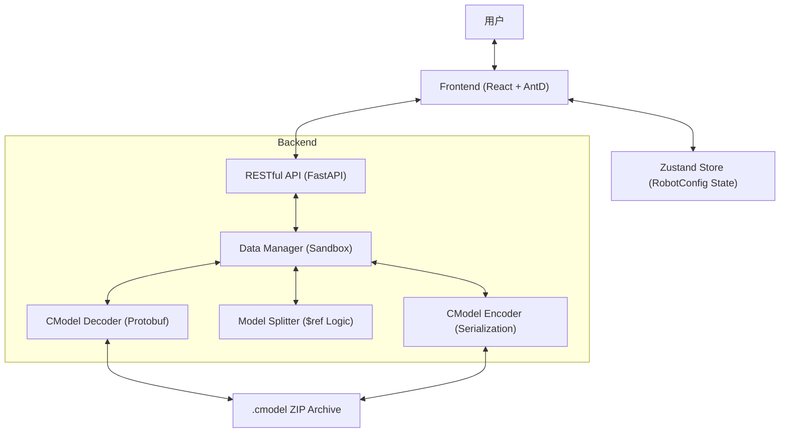

# AMR Studio V4 详细设计文档 (Detailed Design Document)

## 1. 系统架构概述 (System Architecture)

AMR Studio V4 是一个专门为自主移动机器人 (AMR) 打造的配置平台，旨在为 `.cmodel` 格式的机器人描述文件提供可视化的编辑、校验与构建环境。

系统采用典型的 **前后端分离架构**：

- **Frontend (React)**: 负责向导式 UI 交互、3D 渲染可视化、配置状态管理。
- **Backend (FastAPI)**: 负责二进制数据的编解码 (.cmodel <-> JSON)、配置文件的分拆与热加载、编译构建环境。



---

## 2. 后端模块详细设计 (Backend Architecture)

### 2.1 核心入口 (`main.py`)
服务核心，暴露以下 API：
- `POST /api/v1/models/upload`: 上传 `.cmodel`，触发解码、分拆，并初始化沙箱环境。
- `GET /api/v1/models/{id}/components`: 获取组件库列表。
- `PATCH /api/v1/models/{id}/components/{uuid}`: 更新组件属性。
- `POST /api/v1/models/{id}/compile`: 执行模型编译，重新打包为 `.cmodel`。

### 2.2 二进制解码器 (`skills_v2/cmodel_decoder`)
负责处理 `.cmodel` 文件的解压与反序列化。
- **ZIP 协议**: `.cmodel` 容器内包含 `CompDesc.pb` (主结构) 与 `AbilitySet.pb` (算法能力)。
- **CamelCase 转换**: 将严苛的 Protobuf 对象转换为前端易于处理的 CamelCase JSON 格式。

### 2.3 模型分拆逻辑 (`skills_v2/model_splitter`)
由于机器人描述文件可能非常庞大，系统采用“树级分拆”策略：
- **Blueprint (蓝图)**: 保留顶级元数据与递归引用。
- **Modules (模块)**: 将每一个子组件抽离成独立的 JSON 文件。
- **$ref 引用**: 使用 JSON Pointer 风格的引用机制 (`$ref`) 实现解耦。

### 2.4 二进制编码器 (`skills_v2/cmodel_encoder`)
负责将编辑后的 JSON 结构精准回填并序列化。
- **严格 key 对齐**: 必须确保 JSON Key 与 `.proto` 定义完全一致。
- **深度递归**: 递归解析 `$ref` 并重组为完整的 Protobuf Message。

---

## 3. 前端模块详细设计 (Frontend Architecture)

### 3.1 状态管理 (`store/useProjectStore.ts`)
基于 Zustand 实现响应式配置状态机：
- **RobotConfig**: 统一的数据模型，包含身份信息、组件列表与算法能力。
- **Undo/Redo**: 内置操作历史栈，支持配置撤销。
- **双向联动**: 例如更改底盘长度时，自动调整车长偏移量。

### 3.2 导入/导出服务 (`store/ImportService.ts` & `services/ExportService.ts`)
- **ImportService**: 
  - 支持双 Key (Camel/Snake) 兼容性。
  - 自动类别判定 (Category Resolution)：根据主子模块类型元数据自动分类。
- **ExportService**: 
  - 将扁平化的前端状态树形结构化。
  - 进行数据类型强转 (例如将字符串坐标转为 DATA_DOUBLE)。

### 3.3 向导流程 (Wizard Flow)
系统通过 7 个步骤引导用户完成配置：
1. **身份信息**: 机器人名称、序列号、底盘形状。
2. **底盘参数**: 重点关注物理尺寸。
3. **组件库**: 资产管理，支持从已有库中导入或手动创建。
4. **安装坐标**: 基于 6-DOF 的组件位姿映射。
5. **接口连线**: 定义电气连接与总线关系。
6. **功能映射**: 能力集关联。
7. **审计导出**: 最终校验与下载。

---

## 4. 核心协议与数据结构

### 4.1 .cmodel 容器结构
```text
project_uuid_packed.cmodel/
├── CompDesc.json      # 逻辑组件树描述
├── AbilitySet.json    # 算法功能集描述
├── resources/         # 外部资源 (如 mesh)
└── modules/           # 分拆子模块目录 (后端沙箱使用)
```

### 4.2 定义一致性 (proto_final_sync)
前后端交换数据时，必须保证以下联合体字段的严格映射：
- `double_value` -> `doubleValue`
- `int32_value` -> `int32Value`
- `string_value` -> `stringValue`

---

## 5. 遗留问题与未来优化点

1. **属性注入补全**: 手动创建组件后，需要能根据设备类型（如轮组、电机）自动从模板库注入对应的私有属性。
2. **可视化增强**: 目前的 3D 线框预览需进一步细化。
3. **关联描述**: 完善轮子、驱动器、电机之间的反向引用描述。
