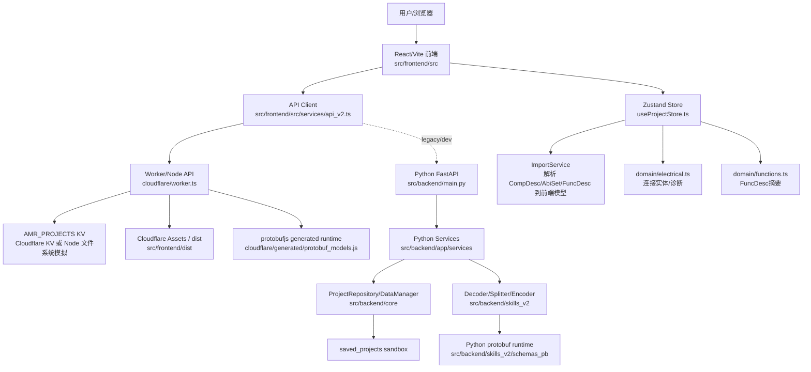
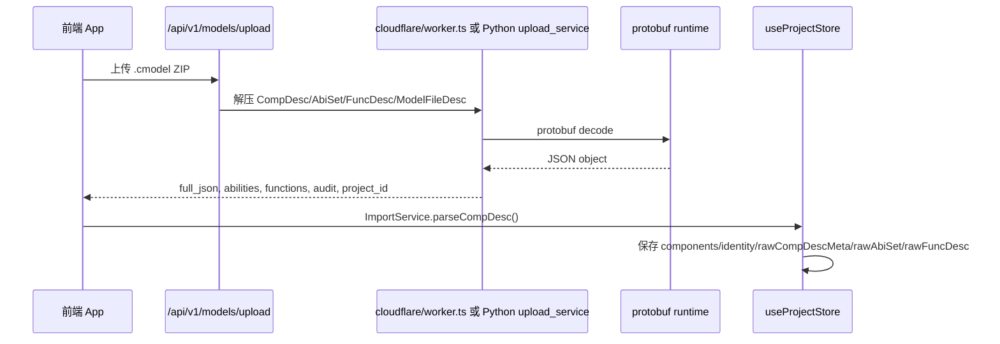
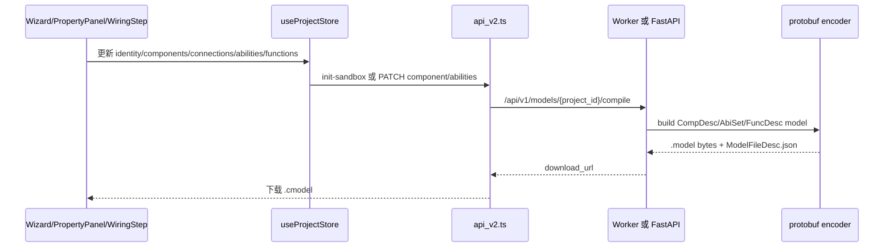
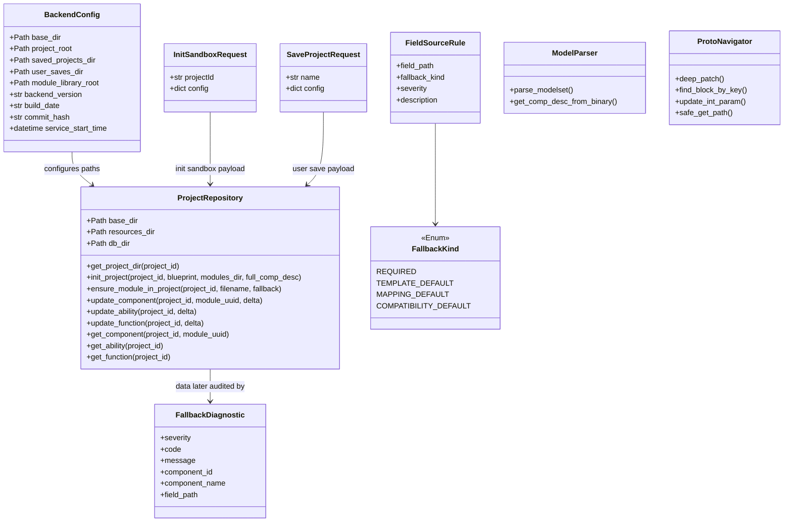
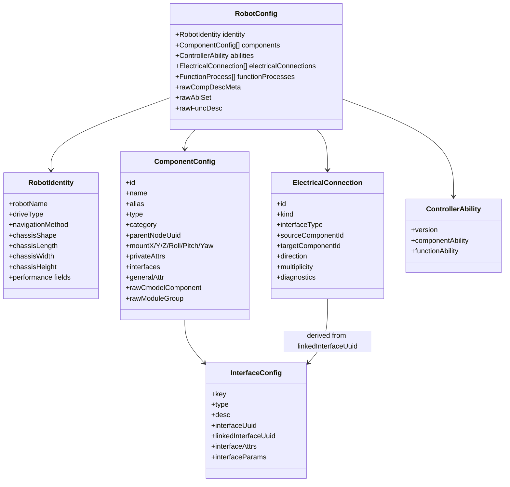
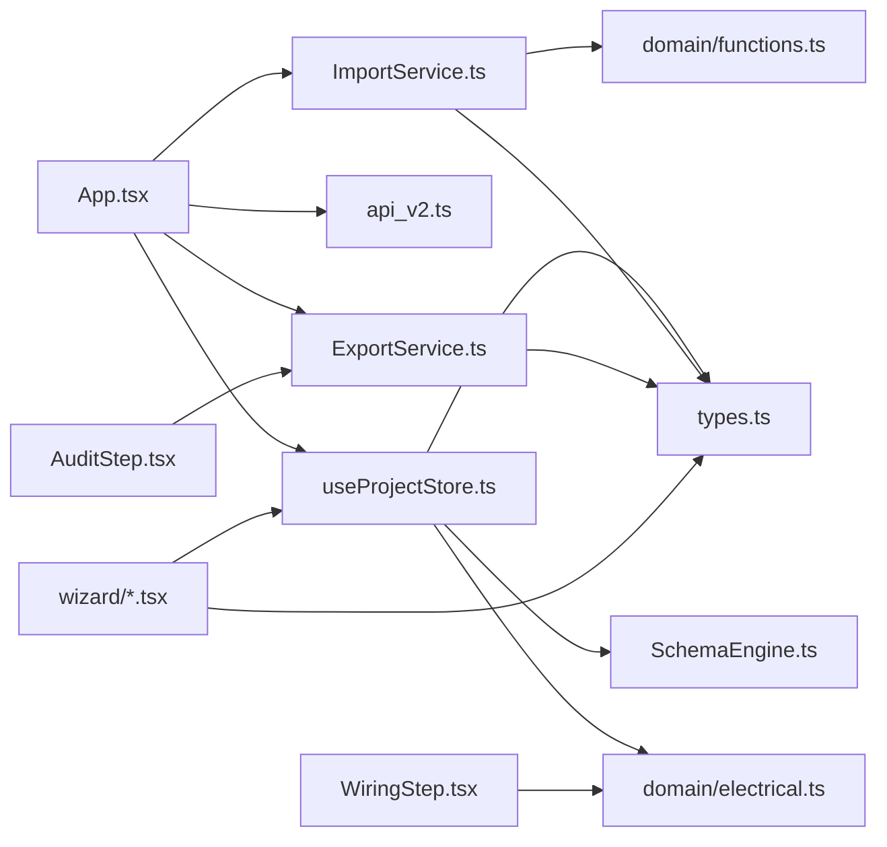
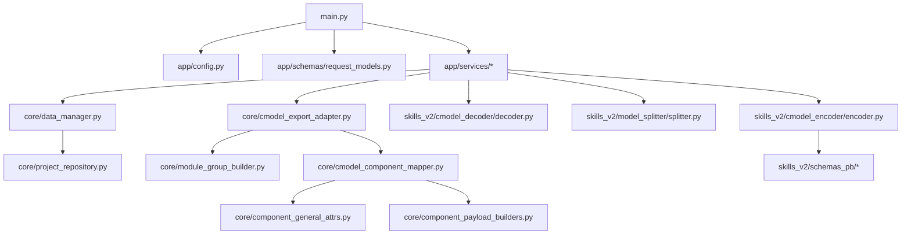
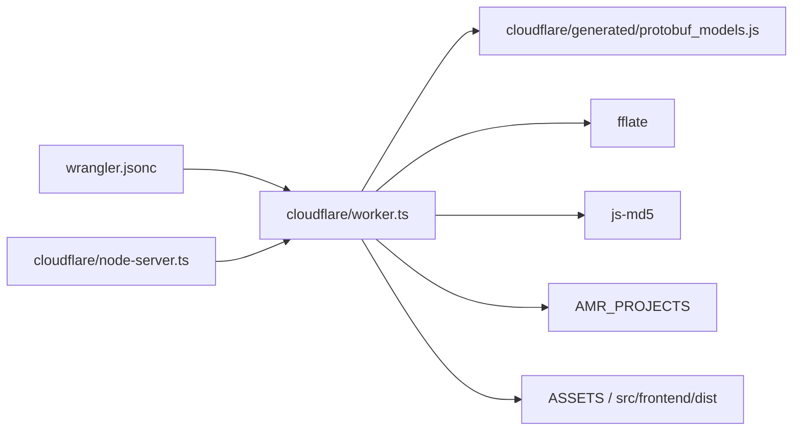

# AMR Studio V4 代码架构分析报告

日期：2026-07-12  
分析对象：当前工作树 `codex/worker-node-server-deploy`，最新提交 `fb03e49e`  
分析原则：仅基于当前代码、配置、资源和测试，不通过猜测、创造、假想补充参数、描述或模型内容。

## 1. 总体结论

AMR Studio V4 当前是一套“前端配置工作台 + cmodel 解析/构建服务 + Worker/Node 同源运行层 + Python 后端保留实现 + skill 工具链”的混合架构。

系统存在两条后端运行路径：

- **Cloudflare Worker / Node 同源路径**：`cloudflare/worker.ts` 是当前 cloud-ai 和 116.62.39.177 服务器 Node 适配部署的主线，负责静态前端、KV/文件模拟持久化、cmodel 上传解析、前端状态重组、protobuf 编码导出。
- **Python FastAPI 路径**：`src/backend/main.py` 与 `src/backend/app/services/*` 是原后端模块化重构成果，仍保留完整的文件系统 sandbox、protobuf 解码/编码、debug artifact、模块 CSV 和单元测试体系。

前端以 React + Zustand 为主，业务状态集中在 `useProjectStore.ts`，数据契约集中在 `types.ts`，导入理解在 `ImportService.ts`，导出/API 在 `ExportService.ts` 与 `api_v2.ts`。

## 2. 顶层框架图



## 3. 运行形态

### 3.1 Cloudflare Worker 形态

入口文件：

- `wrangler.jsonc`
- `cloudflare/worker.ts`
- `src/frontend/dist`

职责：

- Worker Assets 提供前端静态资源。
- `/api/*` 和 `/downloads/*` 先进入 Worker。
- KV binding `AMR_PROJECTS` 保存项目、sandbox 和 artifact。
- `.cmodel` 由 Worker 内部 `fflate` 解压、`protobufjs` 静态生成代码解码和编码。

### 3.2 Node 服务器适配形态

入口文件：

- `cloudflare/node-server.ts`
- `package.json` 的 `worker:server`

职责：

- 将 Node HTTP 请求转换为标准 Web `Request`。
- 调用同一个 `worker.fetch(request, env)`。
- 用本地文件系统模拟 Cloudflare KV。
- 用 `src/frontend/dist` 模拟 Cloudflare Assets。

### 3.3 Python FastAPI 形态

入口文件：

- `src/backend/main.py`
- `src/backend/app/config.py`
- `src/backend/app/services/*`

职责：

- 提供同名 REST API。
- 使用 `skills_v2` 解码、拆分、重组、编码 `.cmodel`。
- 将项目拆成 `blueprint_CompDesc.json + modules/*.json`，方便组件级 PATCH 和 debug artifact。

## 4. 核心数据流

### 4.1 cmodel 导入理解流程



### 4.2 前端编辑与导出流程



### 4.3 Python sandbox 文件流

```mermaid
flowchart LR
  CModel["uploaded.cmodel"] --> Decoder["skills_v2/cmodel_decoder/decoder.py"]
  Decoder --> Decoded["decoded/CompDesc.json\nAbiSet.json\nFuncDesc.json"]
  Decoded --> Splitter["skills_v2/model_splitter/splitter.py"]
  Splitter --> Blueprint["blueprint_CompDesc.json"]
  Splitter --> Modules["modules/module_name_uuid.json"]
  Blueprint --> Repository["ProjectRepository"]
  Modules --> Repository
  Repository --> Compile["compile_service.py"]
  Compile --> Resolve["encoder.resolve_with_fidelity"]
  Resolve --> Encode["encoder.encode_cmodel"]
  Encode --> Output["project_id_packed.cmodel"]
```



## 5. 目录职责

| 路径 | 类型 | 职责 |
| --- | --- | --- |
| `cloudflare/` | Worker/Node 后端 | Worker TypeScript 主实现、Node 适配入口、protobufjs 生成文件和 proto 源文件。 |
| `src/frontend/src/` | React 前端源码 | 导入、建模、器件选择、安装、接线、能力、审计、导出界面与状态管理。 |
| `src/backend/app/` | Python FastAPI 服务层 | API schema、配置、错误处理和按业务拆分的服务函数。 |
| `src/backend/core/` | Python 领域/持久化核心 | cmodel 映射、模块构建、属性映射、fallback 诊断、项目文件仓库。 |
| `src/backend/skills_v2/` | Python cmodel 工具链 | protobuf 解码、CompDesc 拆分、protobuf 编码、pb2 runtime。 |
| `src/backend/resources/` | 后端模块资源库 | XML/JSON 模块定义、AbiSet 基线、模板文件。 |
| `src/frontend/public/worker-data/` | Worker 静态快照 | schemas、boards、user-saves 等 Worker 直接服务的资源快照。 |
| `skills/amr-cmodel-*` | Codex skill 包 | cmodel 解析、构建、批处理验证工具链说明和脚本。 |
| `tests/unit/` | Python 单元测试 | 后端服务、核心映射、protobuf 导出、诊断和 repository 回归测试。 |
| `docs/` / `analysis/` | 文档与分析产物 | 需求、重构、部署、验证、模型对比和本报告。 |

## 6. 入口文件职责

| 文件 | 职责 |
| --- | --- |
| `wrangler.jsonc` | Cloudflare Worker 部署配置，定义 Worker 入口、Assets 目录、KV binding 和 `cloud-ai.work/*` 路由。 |
| `package.json` | 根级 Node 依赖和 `worker:server` 脚本，支撑 Worker 本地/服务器 Node 适配运行。 |
| `src/frontend/package.json` | 前端 React/Vite 依赖和 `dev/build/preview` 脚本。 |
| `src/frontend/vite.config.ts` | Vite 配置；`base: process.env.VITE_BASE || '/'` 支持 Cloudflare 根路径和服务器 `/amr-studio/` 两种部署。 |
| `src/backend/main.py` | Python FastAPI API 路由装配，调用 `app.services`。 |
| `cloudflare/worker.ts` | Worker TypeScript 后端主实现，处理 API、KV、protobuf decode/encode、artifact 下载。 |
| `cloudflare/node-server.ts` | Node 服务器适配层，把 Node HTTP + 文件系统 KV/Assets 适配为 Worker `fetch()` 环境。 |

## 7. Cloudflare / Node 文件职责

| 文件 | 职责 |
| --- | --- |
| `cloudflare/worker.ts` | Worker 后端主文件。包含响应工具、KV key、sandbox record、项目保存加载、cmodel upload、component/ability/function API、protobuf encode/decode、compile/download。 |
| `cloudflare/node-server.ts` | 本地/服务器 Node 运行适配。实现 `AMR_PROJECTS` 文件系统 KV、`ASSETS` 静态文件读取、HTTP 到 Web Request/Response 的桥接。 |
| `cloudflare/generated/protobuf_models.js` | protobufjs 静态生成 runtime，提供 CompDesc/AbiSet/FuncDesc 的 create/encode/decode/fromObject/toObject。 |
| `cloudflare/generated/protobuf_models.d.ts` | generated runtime 的 TypeScript 类型声明。 |
| `cloudflare/proto/controller_model_comp_desc.proto` | CompDesc protobuf 协议定义源。 |
| `cloudflare/proto/controller_model_abi_set.proto` | AbiSet protobuf 协议定义源。 |
| `cloudflare/proto/controller_model_abi_desc.proto` | FuncDesc/Robot_Description protobuf 协议定义源。 |

### Worker 内部功能分组

| 功能分组 | 代表函数 |
| --- | --- |
| HTTP 响应与路由 | `jsonResponse`, `optionsResponse`, `handleApi`, default `fetch` |
| KV key 与安全 path | `projectKey`, `sandboxKey`, `artifactKey`, `safeProjectName`, `safePathId` |
| 静态资源读取 | `fetchAssetJson`, `readAssetJson` |
| sandbox 构建 | `buildSandboxRecord`, `readSandbox`, `writeSandbox` |
| 前端模型到 CompDesc | `mapAttributeToCmodel`, `buildComponentGeneralAttr`, `buildModuleGroup`, `buildFrontendCompDesc` |
| 导入模型保真重组 | `mapRawComponentToCmodel`, `buildRawModuleGroup`, `canBuildFromRawModuleGroups` |
| component PATCH | `normalizeProtoPatch`, `applyProtoPatchToFrontendComponent`, `updateComponent` |
| protobuf | `decodeCompDesc`, `decodeAbiSet`, `decodeFuncDesc`, `encodeCompDesc`, `encodeAbiSet`, `encodeFuncDesc` |
| API 端点 | `listSavedProjects`, `loadSavedProject`, `saveProject`, `initSandbox`, `uploadCmodel`, `compileCmodel`, `downloadArtifact` |

## 8. 前端文件职责

### 8.1 前端入口与布局

| 文件 | 职责 |
| --- | --- |
| `src/frontend/src/main.tsx` | React 应用挂载入口。 |
| `src/frontend/src/App.tsx` | 主应用容器；管理导入、保存、加载、导出、步骤流转和后端 API 调用编排。 |
| `src/frontend/src/DynamicAntdProvider.tsx` | Ant Design 主题/Provider 包装。 |
| `src/frontend/src/index.css` | 全局基础样式。 |
| `src/frontend/src/themes.css` | 主题变量与外观样式。 |
| `src/frontend/src/version.ts` | 前端版本常量。 |
| `src/frontend/src/components/layout/Header.tsx` | 顶部操作栏，触发保存、导出、主题等顶层动作。 |
| `src/frontend/src/components/layout/Sidebar.tsx` | 左侧步骤导航和流程状态展示。 |
| `src/frontend/src/components/WelcomeScreen.tsx` | 欢迎/入口界面，处理导入文件和已保存项目入口。 |
| `src/frontend/src/components/VersionInfo.tsx` | 前后端版本信息展示与格式化。 |

### 8.2 Wizard 业务步骤组件

| 文件 | 职责 |
| --- | --- |
| `IdentityStep.tsx` | 机器人基础身份、底盘尺寸、导航方式、驱动方式等基础信息编辑。 |
| `ChassisStep.tsx` | 底盘几何、运动中心、性能参数和底盘可视化编辑。 |
| `ComponentLibraryStep.tsx` | 模块库展示、分类筛选、器件选择、组件树组织和新增组件。 |
| `ComponentPropertyPanel.tsx` | 单组件属性面板，编辑通用属性、私有属性、接口、结构参数等。 |
| `MountingStep.tsx` | 组件安装位置与坐标参数编辑。 |
| `PowerSystemStep.tsx` | 驱动轮、驱动器、电机、编码器等动力链拓扑配置。 |
| `PowerTopologyCanvas.tsx` | 动力拓扑/底盘相关几何画布显示。 |
| `PowerTopologyPanel.tsx` | 动力链节点属性和分类辅助面板。 |
| `WiringStep.tsx` | 电气连接配置，基于接口兼容性创建连接。 |
| `AbilityStep.tsx` | 控制器能力、算法能力和 Ability 属性编辑。 |
| `AuditStep.tsx` | 导出前审计、诊断展示和导出入口。 |
| `RecursiveAttributeEditor.tsx` | 通用递归属性编辑器，支持嵌套 COMBOX/ARRAY。 |
| `WheelTypeDiagrams.tsx` | 驱动/舵轮类型示意图组件。 |
| `common/SmartForm.tsx` | 智能表单渲染组件，根据属性类型生成输入控件。 |

### 8.3 可视化组件

| 文件 | 职责 |
| --- | --- |
| `ChassisVisualizer.tsx` | 底盘形状和基础尺寸可视化。 |
| `CoordinateVisualizer.tsx` | 组件坐标、朝向、底盘俯视/投影显示。 |

### 8.4 前端服务与状态

| 文件 | 职责 |
| --- | --- |
| `services/api_v2.ts` | 前端 API client，封装版本、schema、保存加载、sandbox、component、ability、function、compile 请求。 |
| `services/ExportService.ts` | 前端导出适配器，校验 identity 字段并把前端状态映射成 CModel 风格 JSON。 |
| `store/types.ts` | 当前主类型契约，定义 `RobotConfig`、`ComponentConfig`、`InterfaceConfig`、`ElectricalConnection`、`FunctionProcess`、`Diagnostic` 等。 |
| `store/types.d.ts` / `types.js` / map | TypeScript 编译生成或声明文件，用于类型引用/历史兼容。 |
| `store/types.extended.ts` | 扩展属性类型兼容工具，归一化 COMBOX 等类型名。 |
| `store/useProjectStore.ts` | 核心 Zustand store，持有项目配置、组件、identity、abilities、undo/redo、更新动作、连接动作、保存加载动作。 |
| `store/useStore.ts` | 早期/简化 store，定义 MCU、IO、轮组、传感器等结构和默认状态。 |
| `store/useUIStore.ts` | UI 状态 store，管理当前步骤、面板开关等。 |
| `store/useThemeStore.tsx` | 主题上下文和切换逻辑。 |
| `store/useVersionInfoStore.ts` | 前后端版本信息获取和格式化状态。 |
| `store/ImportService.ts` | `.cmodel`/CompDesc 导入理解核心；解析组件、identity、安装、接口、raw protobuf 元数据、AbiSet/FuncDesc。 |
| `store/SchemaEngine.ts` | 从模块属性 schema 构建前端属性，提供工程约束、固定源解析、预设选项和 tooltip。 |
| `store/SchemaDefaults.ts` | 从 schema 中抽取默认值，提供底盘默认值加载。 |
| `store/PerformanceConfig.ts` | 满载/空载性能字段比率和兼容默认判断。 |
| `store/abilityGuards.ts` | Ability 属性类型守卫和归一化工具。 |
| `store/domain/electrical.ts` | 电气连接领域逻辑：接口类型归一化、连接分类、方向、多点/点对点、兼容性诊断、连接摘要。 |
| `store/domain/functions.ts` | FuncDesc 功能过程解析和摘要。 |
| `store/master_registry.json` | 前端模块主注册表。 |
| `store/ability_registry.json` | 前端能力注册表/默认能力数据。 |

## 9. Python 后端文件职责

### 9.1 app 层

| 文件 | 职责 |
| --- | --- |
| `src/backend/app/config.py` | 后端配置装配，计算 base_dir、project_root、saved_projects、user_saves、module_library_root、版本信息。 |
| `src/backend/app/errors.py` | 全局异常处理，返回 JSON 500 错误。 |
| `src/backend/app/schemas/request_models.py` | Pydantic 请求模型：`InitSandboxRequest`、`SaveProjectRequest`。 |
| `src/backend/app/services/system_service.py` | 返回后端版本、构建时间、启动时间。 |
| `src/backend/app/services/resource_service.py` | 读取板卡资源、schema 资源，供前端模块库使用。 |
| `src/backend/app/services/project_service.py` | 初始化前端项目 sandbox、保存/加载用户项目、生成 init debug artifacts。 |
| `src/backend/app/services/upload_service.py` | 上传 `.cmodel`，调用 decoder 和 splitter，初始化项目 sandbox。 |
| `src/backend/app/services/model_service.py` | component/ability/function 的读取与 PATCH 服务。 |
| `src/backend/app/services/compile_service.py` | 编译项目为 `.cmodel`，生成 module list CSV、diagnostics、debug artifacts。 |
| `src/backend/app/services/module_list_builder.py` | 从 CompDesc 树提取器件清单 CSV 行。 |
| `src/backend/app/services/debug_artifacts.py` | 创建调试产物目录，写 JSON、复制文件/目录，生成项目相对路径。 |

### 9.2 core 层

| 文件 | 职责 |
| --- | --- |
| `core/project_repository.py` | 文件系统项目仓库；原子写 JSON、深度合并 PATCH、读写模块/Ability/FuncDesc。 |
| `core/data_manager.py` | 对 `ProjectRepository` 的兼容门面，保留旧调用方式。 |
| `core/cmodel_export_adapter.py` | 前端配置到 CompDesc/AbiSet 的顶层适配门面。 |
| `core/module_group_builder.py` | 构建 `moreModuleInfo` 模块组树。 |
| `core/cmodel_component_mapper.py` | 将前端组件映射成 cmodel component JSON。 |
| `core/component_general_attrs.py` | 构建模块通用属性、分类归一化、底盘特殊属性。 |
| `core/component_payload_builders.py` | 构建 extendParams、privateAttrs、interfaceGroups。 |
| `core/ability_export_builder.py` | 构建 AbiSet/functionAbility/childFunction 导出结构。 |
| `core/fallback_diagnostics.py` | 检查导入/导出中 fallback、缺失必填、协议默认风险，输出诊断。 |
| `core/field_source_policy.py` | 字段来源策略表，标记 REQUIRED、TEMPLATE、MAPPING、COMPAT 等 fallback 类型。 |
| `core/module_mappings.py` | 模块分类、子系统、类型 key 映射常量。 |
| `core/module_templates.py` | 按组件类型加载模块模板。 |
| `core/resource_adapter.py` | 资源库适配与 schema/模块资源组织。 |
| `core/xml_component_adapter.py` | 将 XML 模块定义转换为组件 JSON。 |
| `core/mapping_registry.py` | 旧版映射注册工具，把属性元信息/值包装为 property object。 |
| `core/model_parser.py` | 旧版/辅助模型解析类 `ModelParser`。 |
| `core/protobuf_engine.py` | 工业 ModelSet 生成辅助入口。 |
| `core/protobuf_navigator.py` | protobuf-like 结构导航与深度 patch 辅助。 |
| `core/schema_builder.py` | 自定义 CompDesc builder，构造属性、节点、关系。 |
| `core/schema_manager.py` | XML schema 解析和 registry 加载。 |

### 9.3 skills_v2

| 文件 | 职责 |
| --- | --- |
| `skills_v2/cmodel_decoder/decoder.py` | 解压 `.cmodel`，将 `.model` protobuf 二进制解码为 JSON。 |
| `skills_v2/cmodel_decoder/decoder_cli.py` | decoder 命令行入口。 |
| `skills_v2/model_splitter/splitter.py` | 将大型 CompDesc 拆为 blueprint 和独立 module JSON 文件。 |
| `skills_v2/cmodel_encoder/encoder.py` | 读取 blueprint/modules，解析 `$ref`，同步 snake/camel 字段，protobuf 编码并打包 `.cmodel`。 |
| `skills_v2/schemas_pb/*_pb2.py` | Python protobuf 生成代码。 |
| `skills_v2/schemas_pb/*_runtime.py` | protobuf runtime 兼容导入封装。 |

## 10. Skill 文件职责

| 文件 | 职责 |
| --- | --- |
| `skills/amr-cmodel-reader/SKILL.md` | 解析理解 `.cmodel` 的 skill 说明，强调 protobuf 解析、AMR 分类、Excel 报告和禁止编造。 |
| `skills/amr-cmodel-reader/references/reader-rules.md` | reader 的细化规则。 |
| `skills/amr-cmodel-reader/scripts/read_cmodel.py` | 批量/单文件解析 `.cmodel`，输出 summary、CSV、可选 xlsx。 |
| `skills/amr-cmodel-builder/SKILL.md` | 基于人工输入构建 `.cmodel` 的 skill 说明。 |
| `skills/amr-cmodel-builder/references/builder-input-schema.md` | builder 输入 JSON schema 说明。 |
| `skills/amr-cmodel-builder/scripts/build_cmodel_from_input.py` | 校验显式输入，通过后端 API 初始化、编译并输出构建报告。 |
| `skills/amr-cmodel-pipeline/SKILL.md` | cmodel 解析、构建、验证的一体化工作流 skill。 |
| `skills/amr-cmodel-pipeline/references/constraints.md` | pipeline 约束，强调不猜测、不伪造。 |
| `skills/amr-cmodel-pipeline/scripts/cmodel_artifact_check.py` | 检查导出 artifact 是否包含预期文件和结构。 |
| `skills/amr-cmodel-pipeline/scripts/cmodel_batch_summary.py` | 批量上传/解析/汇总 cmodel 器件、连接、函数。 |

## 11. 测试文件职责

| 文件 | 覆盖范围 |
| --- | --- |
| `test_ability_export_builder.py` | AbiSet/functionAbility/childFunction 导出结构。 |
| `test_backend_api_e2e.py` | 上传、PATCH、编译的后端端到端回归。 |
| `test_backend_export_regressions.py` | deep_update、CSV、blueprint 缺失、FuncDesc 保留等回归。 |
| `test_compile_service.py` | module list 提取、IO 分类归一化。 |
| `test_component_general_attrs.py` | 通用属性构建、底盘尺寸、drivewheel/io 默认映射。 |
| `test_component_payload_builders.py` | extendParams、privateAttrs、interfaceGroups 构建。 |
| `test_fallback_diagnostics.py` | fallback/缺失必填/协议默认诊断。 |
| `test_field_source_policy.py` | 字段来源策略和不可猜测规则。 |
| `test_io.py` | 基础 I/O 测试。 |
| `test_model_service.py` | abilities payload 归一化和更新错误处理。 |
| `test_module_group_builder.py` | 模块组树构建。 |
| `test_module_list_builder.py` | module list row 构建和递归提取。 |
| `test_parser_v25.py` | 解析器兼容测试。 |
| `test_project_repository.py` | ProjectRepository 初始化、模块复制、深度合并、读写。 |
| `test_project_service_diagnostics.py` | sandbox 初始化诊断不污染 CompDesc。 |
| `test_protobuf_export_alignment.py` | protobuf 字段同步、AbiSet 类型映射。 |
| `test_resource_adapter_compat.py` | 资源适配器兼容导出。 |
| `test_xml_component_adapter.py` | XML 到组件 JSON 转换。 |
| `true_parser_impl.py` | 测试用 AMR 模型解析器实现。 |

## 12. 类图

### 12.1 Python 后端类图



### 12.2 前端类型/接口图



### 12.3 Worker 数据结构图

```mermaid
classDiagram
  class Env {
    +Fetcher ASSETS
    +KVNamespace AMR_PROJECTS
  }

  class SandboxRecord {
    +projectId
    +sourceKind
    +config
    +components
    +abilities
    +functions
    +rawFuncDesc
    +fullJson
    +importAudit
    +createdAt
    +updatedAt
  }

  class SavedProjectIndexItem {
    +name
    +mtime
    +robotName
    +source
  }

  class SaveProjectPayload {
    +name
    +config
  }

  Env --> SandboxRecord : KV sandbox:projectId
  Env --> SavedProjectIndexItem : KV project index
  SaveProjectPayload --> Env : saveProject()
```

## 13. 文件间关系图

### 13.1 前端依赖主链



### 13.2 Python 后端依赖主链



### 13.3 Worker/Node 依赖主链



## 14. API 接口功能描述

### 14.1 Worker/Python 共同 REST API

| Method | Path | 功能 | 主要实现 |
| --- | --- | --- | --- |
| GET | `/api/v1/system/version` | 返回版本、启动时间、runtime、迁移端点。 | Worker `handleApi`; Python `system_service.py` |
| GET | `/api/v1/schemas` | 返回模块 schema/资源库快照。 | Worker asset JSON; Python `resource_service.list_schemas` |
| GET | `/api/v1/resources/boards` | 返回板卡资源。 | Worker asset JSON; Python `resource_service.list_boards` |
| GET | `/api/v1/projects/saved-list` | 列出保存项目。 | Worker KV + snapshot; Python `project_service.list_saved_projects` |
| GET | `/api/v1/projects/load/{name}` | 加载保存项目。 | Worker KV + snapshot; Python `project_service.load_user_project_config` |
| POST | `/api/v1/projects/save` | 保存前端项目配置。 | Worker KV; Python `project_service.save_user_project_config` |
| POST | `/api/v1/models/upload` | 上传并解析 `.cmodel`。 | Worker `uploadCmodel`; Python `upload_service.upload_cmodel_to_project` |
| POST | `/api/v1/models/init-sandbox` | 由前端 config 初始化模型 sandbox。 | Worker `initSandbox`; Python `project_service.initialize_project_sandbox` |
| GET | `/api/v1/models/{project_id}/components/{module_uuid}` | 获取组件详情。 | Worker `getComponent`; Python `model_service.get_component` |
| PATCH | `/api/v1/models/{project_id}/components/{module_uuid}` | 更新组件字段。 | Worker `updateComponent`; Python `model_service.update_component` |
| GET | `/api/v1/models/{project_id}/abilities` | 获取 AbiSet/abilities。 | Worker `getAbilities`; Python `model_service.get_abilities` |
| PATCH | `/api/v1/models/{project_id}/abilities` | 更新 abilities。 | Worker `updateAbilities`; Python `model_service.update_abilities` |
| GET | `/api/v1/models/{project_id}/functions` | 获取 FuncDesc/function processes。 | Worker `getFunctions`; Python `model_service.get_functions` |
| POST | `/api/v1/models/{project_id}/compile` | 编译导出 `.cmodel`。 | Worker `compileCmodel`; Python `compile_service.compile_project` |
| GET | `/downloads/{project_id}/{artifact}` | 下载导出 artifact/debug 文件。 | Worker `downloadArtifact`; Python StaticFiles |

### 14.2 前端服务接口

| 函数 | 调用后端 | 功能 |
| --- | --- | --- |
| `apiFetchBackendVersion` | GET `/api/v1/system/version` | 获取后端版本。 |
| `apiFetchSchemas` | GET `/api/v1/schemas` | 获取模块 schema。 |
| `apiFetchBoardXml` | GET `/models/v4/BoardDescriptions.xml` | 获取板卡 XML 静态资源。 |
| `apiListSavedProjects` | GET `/api/v1/projects/saved-list` | 获取保存项目列表。 |
| `apiSaveProject` | POST `/api/v1/projects/save` | 保存项目配置。 |
| `apiLoadProject` | GET `/api/v1/projects/load/{name}` | 加载项目配置。 |
| `apiInitSandbox` | POST `/api/v1/models/init-sandbox` | 初始化后端 sandbox。 |
| `apiFetchComponentDetails` | GET component | 拉取组件详情。 |
| `apiUpdateComponent` | PATCH component | 更新组件。 |
| `apiFetchAbilities` | GET abilities | 拉取 AbiSet。 |
| `apiUpdateAbilities` | PATCH abilities | 更新 AbiSet。 |
| `apiFetchFunctions` | GET functions | 拉取 FuncDesc。 |
| `apiCompileAndDownload` | POST compile | 编译并触发浏览器下载。 |

## 15. 资源与生成物说明

| 路径/文件 | 性质 | 说明 |
| --- | --- | --- |
| `src/backend/resources/modules/*.json|*.xml` | 模块库事实源 | 每个器件/通用模块的 JSON/XML 定义，包含通用属性、私有属性、接口能力/参数等。 |
| `src/backend/resources/definitions/*.xml` | 类型定义 | 按模块大类组织的定义文件。 |
| `src/backend/resources/AbiSet_base.json` | 能力基线 | Python repository 初始化 AbiSet 时使用。 |
| `src/backend/user_saves/*.json` | 示例/用户项目 | 服务器/后端可加载的保存项目。 |
| `src/frontend/public/worker-data/*.json` | Worker 静态快照 | Worker 没有文件系统资源库时使用的 schema、boards、保存项目快照。 |
| `src/frontend/dist/` | 构建产物 | Vite 输出，不作为源码分析主依据。 |
| `.server-kv/` | 本地运行产物 | Node KV 模拟目录，不应提交。 |
| `artifacts/` | 验证产物 | cmodel roundtrip、解析对比等临时/验证输出，不作为运行源码。 |

## 16. 关键设计约束

- 模型字段不得通过猜测、创造、假想补齐。
- `0`、`false`、空字符串、空数组、UUID、interfaceUuid、linkedInterfaceUuid 都是有效源值，不能因 falsy 被丢弃。
- 导入模型再导出时，应走 `parse -> frontend state -> build/compose -> protobuf encode -> cmodel export`，不能直接回传原始 zip 冒充流程验证。
- 当前 protobuf decode/encode 只保证当前 proto 可识别字段的语义一致；未知 wire field 不会被当前链路保留。
- Worker 与 Python 后端存在重复业务逻辑，未来需要明确主线，否则会产生行为漂移。

## 17. 主要技术债与优化点

| 类型 | 说明 | 建议 |
| --- | --- | --- |
| 双后端逻辑重复 | Worker 和 Python 都实现了 upload/compile/patch/映射逻辑。 | 抽象共享协议测试和 golden roundtrip 套件，确定 Worker 为生产主线或保留 Python 为工具链。 |
| generated 文件体积大 | `protobuf_models.js` 很大，但 Worker 必需。 | 保留生成源和生成命令说明，避免手改生成文件。 |
| 前端状态集中度高 | `useProjectStore.ts` 负责过多业务。 | 继续拆分 identity、components、abilities、wiring、persistence slices。 |
| ImportService 复杂度高 | 导入解析承担 topology、identity、raw 保真、能力解析。 | 拆为 parser、normalizer、topology resolver、raw-preservation 四层。 |
| 资源库双轨 | 后端 XML/JSON 和 Worker snapshot 并存。 | 建立 snapshot 生成脚本和校验，保证资源一致性。 |
| unknown field 保真 | 当前 protobuf 重编码会规范化二进制，未知字段无法证明保留。 | 如业务需要字节级/unknown 保真，引入 wire-level 保留机制。 |

## 18. 验证记录

本报告基于以下命令/来源进行结构分析：

```bash
find src/backend -maxdepth 4 -type f
find src/frontend/src cloudflare tests/unit skills/amr-cmodel-* -maxdepth 4 -type f
rg -n '^(class|def|async def) ' src/backend/app src/backend/core
rg -n '^(export )?(class|interface|type|const|function)' src/frontend/src cloudflare
```

配套输出：

- `docs/CODE_FILE_RESPONSIBILITY_INDEX_20260712.md`：主要源码、配置、skill、测试文件逐文件职责索引，覆盖 273 个文件。
- `docs/PROJECT_FILE_INVENTORY_20260712.csv`：全仓库 tracked 文件分类清单，覆盖 24,669 个 tracked 路径；其中包含仓库已追踪的依赖/构建支持文件，因此作为全量检索清单使用，不建议作为人工阅读主文档。

已知当前工作区仍存在未提交的本地缓存/产物变更：

- `node_modules/.package-lock.json`
- `src/frontend/node_modules/.vite/*`
- `src/frontend/dist/index.html`
- `src/frontend/tsconfig.tsbuildinfo`
- `artifacts/`
- `dist/`
- `src/backend/saved_projects/*`

这些文件不作为本报告的源码职责判断依据。
