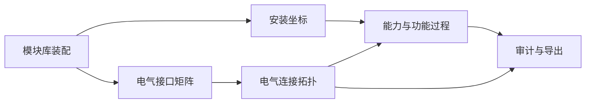

# 前端电气连接与功能能力详细设计文档

日期：2026-06-12

## 0. 文档目的

本文档在以下报告基础上展开：

- `docs/CMODEL_MODULE_LIBRARY_PIPELINE_ANALYSIS_20260612.md`
- `docs/CROSS_CMODEL_GAP_ANALYSIS_20260612.md`
- `docs/FRONTEND_ELECTRICAL_ABILITY_REDESIGN_20260612.md`

目标是把前端从当前的“组件表单 + 简单接口连线 + 能力表单”升级为可支撑真实 `cmodel` 的设计：

- 能完整表达电气接口和电气连接关系。
- 能完整展示并逐步编辑 `AbiSet` 能力描述。
- 能显式承载 `FuncDesc` 功能过程。
- 能在导入、编辑、审计、导出全过程中保持字段来源可追溯。

本次设计前已执行回归验证：

```bash
src/backend/.venv310/bin/python -m unittest discover -s tests/unit -p 'test_*.py'
```

结果：

- 用例数：53
- 结果：OK

## 1. 设计原则

### 1.1 事实来源优先

前端不得通过猜测、创造、假想的方式生成参数、描述信息、连接关系或功能过程。

允许的数据来源：

- 导入的 `CompDesc.json`、`AbiSet.json`、`FuncDesc.json`。
- 后端解析出的模块库注册表。
- 后端或前端静态模块库中明确存在的模板。
- 用户显式输入或选择。
- protobuf schema 中明确存在的字段结构。

不允许的数据来源：

- 根据模块名推断设备型号。
- 根据字段 `desc` 推断 `typeKey`。
- 根据接口名自动创建业务连接。
- 根据能力名称自动创建 `FuncDesc.function`。
- 根据 UI 默认文案生成真实协议字段。

### 1.2 可见优先于自动修复

当字段缺失或来源不明时：

- 前端应展示“缺失/未知/未配置”。
- 前端应输出诊断。
- 前端可以引导用户补录。
- 前端不能静默补造。

### 1.3 语义模型优先于 UI 控件

UI 不是数据模型。当前前端过多语义隐含在组件 props 和表单字段里，重构后应先建立语义模型：

- `ComponentConfig`
- `InterfaceInstance`
- `ElectricalConnection`
- `AbilityModel`
- `FunctionProcess`
- `Diagnostic`

页面只负责展示、编辑和校验这些模型。

### 1.4 导入保真，导出可审计

导入后必须尽可能保留原始 cmodel 信息：

- 原始组件 UUID。
- 原始接口 UUID。
- 原始连接关系。
- 原始能力列表。
- 原始功能过程。
- 原始空值状态。

导出前必须生成可审计产物：

- 前端语义模型。
- 电气连接实体。
- 能力模型。
- 功能过程模型。
- 诊断报告。
- 后端 debug artifacts 链接。

## 2. 当前问题清单

### 2.1 电气连接问题

当前实现：

- `ComponentConfig.interfaces[].linkedInterfaceUuid` 保存连接。
- `useProjectStore.linkInterface()` 只修改源接口。
- `WiringStep` 通过下拉框编辑连接。
- `AuditStep` 有部分 DI/DO 和 CAN 检查。

主要问题：

- 没有独立连接实体，无法表达连接来源、连接类型、方向、校验状态。
- 连接是单向字段，不易保证双方引用一致。
- 无法区分通信总线、IO 信号、电源、BAT、板载 SPI。
- 无法表达总线多节点关系。
- 无法对接口参数进行结构化编辑和校验。
- 导出时缺少显式连接同步步骤。
- UI 中看不到完整电气网络，只能看到局部接口。

### 2.2 能力描述问题

当前实现：

- `ability_registry.json` 只包含 `functionAbility`。
- `AbilityStep` 渲染 `functionAbility` 表单。
- `ExportService.exportAbilities()` 只导出 `functionAbility`。
- `componentAbility` 没有作为一等模型呈现。

主要问题：

- `componentAbility` 导入后可能存在，但前端没有完整设计。
- FIXED_E 选择器缺少连接状态和来源解释。
- 能力和组件、接口、电气连接之间缺少显式关系。
- 不能回答“这个能力为什么成立”。

### 2.3 功能过程问题

当前实现：

- `FuncDesc.json` 后端可以解析和保存。
- 前端没有 `FuncDesc` 语义模型。
- UI 没有功能过程展示和编辑。

主要问题：

- `FuncDesc` 在前端不可见。
- 新建项目无法明确配置功能过程。
- 导入项目无法确认功能过程是否被保留。
- 导出时用户无法看到功能过程是否完整。

## 3. 总体架构

### 3.1 分层

```text
UI Pages
  -> View Models
  -> Domain Models
  -> Store Slices
  -> Import/Export Materializers
  -> Backend APIs
  -> CModel Artifacts
```

### 3.2 核心领域对象

```text
RobotProject
  ├─ identity
  ├─ components
  ├─ interfaces
  ├─ electricalConnections
  ├─ abilities
  ├─ functionProcesses
  └─ diagnostics
```

### 3.3 数据流

导入：

```text
.cmodel
  -> backend protobuf decode
  -> CompDesc.json / AbiSet.json / FuncDesc.json
  -> frontend ImportService
  -> ComponentConfig[]
  -> InterfaceInstance[]
  -> ElectricalConnection[]
  -> AbilityModel
  -> FunctionProcess[]
  -> Diagnostics
```

编辑：

```text
用户操作
  -> domain action
  -> store slice
  -> local validator
  -> view model refresh
```

导出：

```text
store domain model
  -> local validation
  -> materialize linkedInterfaceUuid
  -> materialize AbiSet
  -> materialize FuncDesc
  -> backend init/patch
  -> backend validate
  -> backend compile
  -> debug artifacts
```

## 4. 页面信息架构

### 4.1 新向导步骤

| 序号 | 页面 | 主要职责 | 主要模型 |
| ---: | --- | --- | --- |
| 1 | 项目身份 | 机器人基本信息 | `RobotIdentity` |
| 2 | 底盘与运动机构 | 底盘、轮组、驱动机构 | `ComponentConfig` |
| 3 | 模块库装配 | 添加组件、编辑私有属性 | `ComponentConfig` |
| 4 | 安装坐标 | 机械层级和 6-DOF | `ComponentConfig.parentNodeUuid` |
| 5 | 电气接口矩阵 | 接口实例、接口参数 | `InterfaceInstance` |
| 6 | 电气连接拓扑 | 连接实体、拓扑图、连接校验 | `ElectricalConnection` |
| 7 | 能力与功能过程 | 能力映射、功能过程 | `AbilityModel`、`FunctionProcess` |
| 8 | 审计与导出 | 全量校验、导出、artifacts | `Diagnostic` |

### 4.2 页面关系



说明：

- 组件装配生成接口实例。
- 接口矩阵提供接口参数编辑。
- 连接拓扑使用接口实例创建电气连接。
- 能力与功能过程引用组件、接口和连接。
- 审计页统一校验。

## 5. 领域模型设计

### 5.1 `InterfaceInstance`

```ts
export type FieldSource =
  | 'imported_cmodel'
  | 'module_library'
  | 'user_input'
  | 'backend_registry'
  | 'unknown';

export interface InterfaceInstance {
  componentId: string;
  componentName: string;
  interfaceUuid: string;
  key: string;
  type: string;
  desc?: string;
  path?: string;
  linkedInterfaceUuid: string[];
  interfaceAttrs?: unknown;
  interfaceParams?: unknown;
  source: FieldSource;
  sourceRef?: string;
  readonly?: boolean;
  diagnostics: Diagnostic[];
}
```

字段说明：

- `componentId`：所属组件 UUID。
- `interfaceUuid`：接口实例 UUID，必须稳定。
- `linkedInterfaceUuid`：协议字段原始表达，仍需保留。
- `source`：接口来源。
- `diagnostics`：接口自身问题，例如缺少参数模板、类型未注册。

### 5.2 `ElectricalConnection`

```ts
export type ElectricalConnectionKind =
  | 'communication_bus'
  | 'io_signal'
  | 'power'
  | 'onboard'
  | 'audio_video'
  | 'unknown';

export interface ElectricalConnection {
  id: string;
  kind: ElectricalConnectionKind;
  interfaceType: string;
  sourceComponentId: string;
  sourceInterfaceUuid: string;
  targetComponentId: string;
  targetInterfaceUuid: string;
  direction: 'source_to_target' | 'target_to_source' | 'bidirectional' | 'unknown';
  multiplicity: 'point_to_point' | 'bus_multi_drop' | 'unknown';
  params?: Record<string, unknown>;
  source: 'imported_cmodel' | 'user_selected' | 'backend_resolved';
  sourceRefs: string[];
  diagnostics: Diagnostic[];
}
```

连接分类规则：

| 类型 | kind | direction | multiplicity |
| --- | --- | --- | --- |
| `CAN` | `communication_bus` | `bidirectional` | `bus_multi_drop` |
| `RS485` | `communication_bus` | `bidirectional` | `bus_multi_drop` |
| `RS232` | `communication_bus` | `bidirectional` | `point_to_point` |
| `UART` | `communication_bus` | `bidirectional` | `point_to_point` |
| `ETH` | `communication_bus` | `bidirectional` | `point_to_point` |
| `DI`/`DO` | `io_signal` | 按输入输出判断 | `point_to_point` |
| `AI`/`AO` | `io_signal` | 按输入输出判断 | `point_to_point` |
| `BAT` | `power` | `source_to_target` 或 `unknown` | `point_to_point` |
| `SPI` | `onboard` | `bidirectional` | `point_to_point` |
| `SPK`/`LVDS`/`SMA` | `audio_video` | `unknown` | `point_to_point` |

注意：

- 分类规则只能用于 UI 分类和校验提示。
- 不能用分类规则自动创建连接。
- 如果模块库对某接口给出更具体规则，以模块库为准。

### 5.3 `AbilityModel`

```ts
export interface AbilityModel {
  version: string;
  componentAbility: ComponentAbility[];
  functionAbility: FunctionAbility[];
  source: 'imported_cmodel' | 'ability_registry' | 'user_edited';
  diagnostics: Diagnostic[];
}
```

设计要求：

- `componentAbility` 必须进入前端模型。
- `functionAbility` 必须保留原始 `type`、`desc`、`tips`、`childFunction`、`attr`。
- 对 `FIXED_E` / `DATA_FIXED_E` 必须保存目标组件 UUID 与 fixedSource 过滤条件。

### 5.4 `FunctionProcess`

```ts
export interface FunctionEndpoint {
  kind: 'component' | 'interface' | 'connection' | 'ability' | 'literal';
  ref: string;
  role?: string;
  desc?: string;
}

export interface FunctionProcess {
  id: string;
  type: string;
  desc: string;
  trigger?: string;
  inputs: FunctionEndpoint[];
  outputs: FunctionEndpoint[];
  relatedAbilities: string[];
  relatedComponents: string[];
  relatedConnections: string[];
  source: 'imported_func_desc' | 'user_created' | 'template';
  raw?: unknown;
  editableLevel: 'readonly' | 'mapped_edit' | 'full_edit';
  diagnostics: Diagnostic[];
}
```

设计要求：

- 导入的 `FuncDesc` 即使暂时不能完整编辑，也必须可见。
- `raw` 用于保留未完全语义化的原始数据。
- `editableLevel` 明确告诉用户当前支持程度。
- 不存在模板时，不生成假过程。

### 5.5 `Diagnostic`

```ts
export interface Diagnostic {
  severity: 'error' | 'warning' | 'info' | 'trace';
  code: string;
  message: string;
  path?: string;
  componentId?: string;
  interfaceUuid?: string;
  connectionId?: string;
  abilityType?: string;
  functionId?: string;
  source?: string;
}
```

## 6. Store 设计

### 6.1 Slice 拆分

建议拆分为：

- `projectSlice`
- `componentSlice`
- `interfaceSlice`
- `connectionSlice`
- `abilitySlice`
- `functionSlice`
- `auditSlice`

### 6.2 `interfaceSlice`

状态：

```ts
interface InterfaceSlice {
  interfaceIndex: Record<string, InterfaceInstance>;
  componentInterfaces: Record<string, string[]>;
  rebuildInterfaceIndex: () => void;
  updateInterfaceParams: (interfaceUuid: string, patch: unknown) => void;
}
```

职责：

- 从组件中建立接口索引。
- 提供按组件、按类型、按 UUID 查询。
- 维护接口参数编辑。
- 不直接创建电气连接。

### 6.3 `connectionSlice`

状态：

```ts
interface ConnectionSlice {
  electricalConnections: ElectricalConnection[];
  rebuildConnectionsFromInterfaces: () => void;
  createConnection: (draft: ConnectionDraft) => ConnectionResult;
  updateConnection: (id: string, patch: Partial<ElectricalConnection>) => ConnectionResult;
  removeConnection: (id: string) => void;
  materializeConnectionsToInterfaces: () => void;
}
```

职责：

- 从 `linkedInterfaceUuid` 反建连接。
- 用连接实体统一管理编辑。
- 导出前将连接实体回写到接口字段。
- 输出连接诊断。

### 6.4 `abilitySlice`

状态：

```ts
interface AbilitySlice {
  abilities: AbilityModel;
  updateFunctionAbilityAttr: (...args: unknown[]) => void;
  updateComponentAbility: (...args: unknown[]) => void;
  validateAbilityRefs: () => Diagnostic[];
}
```

职责：

- 管理 `AbiSet`。
- 解析和编辑 `componentAbility`、`functionAbility`。
- 验证组件引用。

### 6.5 `functionSlice`

状态：

```ts
interface FunctionSlice {
  functionProcesses: FunctionProcess[];
  importFuncDesc: (json: unknown) => void;
  updateFunctionProcess: (id: string, patch: Partial<FunctionProcess>) => void;
  validateFunctionProcesses: () => Diagnostic[];
}
```

职责：

- 管理 `FuncDesc` 语义层。
- 保留原始数据。
- 输出功能过程诊断。

## 7. 导入设计

### 7.1 导入步骤

```text
handleImport()
  -> upload cmodel
  -> fetch AbiSet
  -> receive CompDesc full_json
  -> parse components
  -> build interface index
  -> rebuild electrical connections
  -> parse abilities
  -> parse function processes
  -> run diagnostics
  -> loadProject()
```

### 7.2 连接反建规则

输入：

- `ComponentConfig[]`
- 每个组件的 `interfaces[].linkedInterfaceUuid`

输出：

- `ElectricalConnection[]`

规则：

- 遍历所有接口。
- 对每个 `linkedInterfaceUuid` 查找目标接口。
- 如果目标不存在，生成 `error: CONNECTION_TARGET_NOT_FOUND`。
- 如果目标存在，创建连接实体。
- 连接 ID 使用稳定规则：`conn_${min(sourceUuid,targetUuid)}_${max(sourceUuid,targetUuid)}`。
- 对同一对接口重复出现的引用去重。
- 保留原始方向到 `sourceRefs`。

### 7.3 能力导入规则

输入：

- `AbiSet.json`
- `ability_registry.json`

输出：

- `AbilityModel`

规则：

- 优先使用导入模型中的能力。
- registry 只用于补充 UI 编辑结构。
- registry 不得覆盖导入模型的事实值。
- 未识别能力保留为 raw，并显示只读或有限编辑。

### 7.4 功能导入规则

输入：

- `FuncDesc.json`

输出：

- `FunctionProcess[]`

规则：

- 保留 `function` 列表数量。
- 能解析的字段映射到 `FunctionProcess`。
- 不能解析的字段进入 `raw`。
- 不丢弃未知功能。
- 不自动创造缺失功能。

## 8. 导出设计

### 8.1 导出前预处理

```text
validateLocal()
  -> materializeConnectionsToInterfaces()
  -> materializeAbilityModel()
  -> materializeFunctionProcesses()
  -> send to backend
```

### 8.2 连接物化规则

目标：

- 从 `ElectricalConnection[]` 回写到 `ComponentConfig.interfaces[].linkedInterfaceUuid`。

规则：

- 先清空由连接实体管理的 `linkedInterfaceUuid`。
- 对每条连接写入源接口到目标接口引用。
- 如果原模型要求双向引用，由后端或连接策略明确指定后再写双向。
- 不允许写入不存在接口 UUID。
- 不允许写入被诊断为 `error` 的连接。

### 8.3 能力物化规则

目标：

- 输出完整 `AbiSet` patch。

规则：

- `componentAbility` 原样保留或按用户编辑输出。
- `functionAbility` 使用现有 mapper 输出。
- FIXED_E 目标必须存在。
- 不存在目标时阻断导出。

### 8.4 功能过程物化规则

目标：

- 输出 `FuncDesc` patch 或语义模型。

阶段性策略：

- P0：只读展示，不修改导出。
- P1：导入后原样保留，导出时透传并显示状态。
- P2：支持结构化编辑并输出 patch。

## 9. 页面详细设计

### 9.1 电气接口矩阵页

布局：

```text
左侧：组件树 / 分类筛选
中间：接口矩阵表
右侧：接口详情 / 参数编辑 / 诊断
```

接口矩阵列：

- 组件名称。
- 子系统。
- 主类型。
- 子类型。
- 接口 key。
- 接口 type。
- interfaceUuid。
- 连接数。
- 参数完整度。
- 来源。
- 诊断。

操作：

- 按接口类型过滤。
- 按组件过滤。
- 查看接口参数。
- 编辑接口参数。
- 跳转到连接拓扑页并定位接口。

状态：

- 空闲接口。
- 已连接接口。
- 参数缺失接口。
- 未注册接口类型。
- 板载只读接口。

### 9.2 电气连接拓扑页

Tabs：

- 总览拓扑。
- 通信总线。
- IO 信号。
- 电源/BAT。
- 板载连接。
- 连接清单。

连接清单列：

- 连接 ID。
- 连接类型。
- 源组件。
- 源接口。
- 目标组件。
- 目标接口。
- 方向。
- 来源。
- 诊断。

拓扑图：

- 可使用当前项目已有 `@xyflow/react`。
- 节点为组件。
- 端口为接口。
- 边为 `ElectricalConnection`。

交互：

- 选择源接口。
- 选择目标接口。
- 创建连接前实时校验。
- 编辑连接参数。
- 删除连接。
- 查看连接影响的能力/功能过程。

### 9.3 能力与功能过程页

Tabs：

- 硬件能力源。
- 能力映射。
- 功能过程。
- 能力诊断。

硬件能力源：

- 组件提供的接口能力。
- 私有属性中的能力相关字段。
- 模块库定义的能力。

能力映射：

- 复用 `RecursiveAttributeEditor`。
- FIXED_E 选择器必须显示：
  - 组件名称。
  - 类型。
  - fixedSource 是否匹配。
  - 是否已接线。
  - 相关接口状态。

功能过程：

- 过程列表。
- 过程详情。
- 输入/输出端点。
- 关联能力。
- 关联组件。
- 关联连接。
- 原始 `FuncDesc` raw 查看。

### 9.4 审计与导出页

分区：

- 组件完整性。
- 接口完整性。
- 电气连接完整性。
- 能力完整性。
- 功能过程完整性。
- 后端校验。
- debug artifacts。

关键指标：

- 组件数。
- 接口数。
- 连接数。
- 悬挂连接数。
- `componentAbility` 数量。
- `functionAbility` 数量。
- `FuncDesc.function` 数量。
- error/warning 数量。

## 10. 校验规则

### 10.1 接口校验

| code | severity | 规则 |
| --- | --- | --- |
| `INTERFACE_UUID_MISSING` | error | 接口缺少 UUID |
| `INTERFACE_TYPE_MISSING` | error | 接口缺少 type |
| `INTERFACE_TYPE_UNREGISTERED` | warning | 接口类型不在模块库注册表 |
| `INTERFACE_PARAM_SOURCE_UNKNOWN` | warning | 参数来源不明 |
| `INTERFACE_PARAM_REQUIRED_MISSING` | error | 必填接口参数缺失 |

### 10.2 连接校验

| code | severity | 规则 |
| --- | --- | --- |
| `CONNECTION_TARGET_NOT_FOUND` | error | 连接目标接口不存在 |
| `CONNECTION_SOURCE_NOT_FOUND` | error | 连接源接口不存在 |
| `CONNECTION_TYPE_INCOMPATIBLE` | error | 接口类型不兼容 |
| `CONNECTION_IO_DIRECTION_INVALID` | error | DI/DO 方向错误 |
| `CONNECTION_DUPLICATED` | warning | 重复连接 |
| `CONNECTION_MULTIPLICITY_EXCEEDED` | error | 超出接口连接数量 |
| `CONNECTION_ONBOARD_READONLY` | info | 板载连接只读 |

### 10.3 能力校验

| code | severity | 规则 |
| --- | --- | --- |
| `ABILITY_COMPONENT_REF_MISSING` | error | 能力引用组件不存在 |
| `ABILITY_FIXED_SOURCE_MISMATCH` | error | FIXED_E 目标不满足 fixedSource |
| `ABILITY_COMPONENT_DISCONNECTED` | warning | 能力组件未接入必要电气连接 |
| `COMPONENT_ABILITY_EMPTY` | info | componentAbility 为空 |
| `FUNCTION_ABILITY_EMPTY` | warning | functionAbility 为空 |

### 10.4 功能过程校验

| code | severity | 规则 |
| --- | --- | --- |
| `FUNC_PROCESS_EMPTY` | warning | 功能过程为空 |
| `FUNC_PROCESS_RAW_ONLY` | info | 功能过程仅 raw 保留 |
| `FUNC_PROCESS_ABILITY_REF_MISSING` | error | 引用能力不存在 |
| `FUNC_PROCESS_COMPONENT_REF_MISSING` | error | 引用组件不存在 |
| `FUNC_PROCESS_CONNECTION_REF_MISSING` | error | 引用连接不存在 |

## 11. 后端 API 契约

### 11.1 接口索引

```http
GET /api/v1/models/{projectId}/interfaces
```

返回：

```json
{
  "interfaces": [],
  "diagnostics": []
}
```

### 11.2 连接实体

```http
GET /api/v1/models/{projectId}/connections
PUT /api/v1/models/{projectId}/connections
```

请求：

```json
{
  "connections": []
}
```

返回：

```json
{
  "status": "success",
  "connections": [],
  "diagnostics": []
}
```

### 11.3 功能过程

```http
GET /api/v1/models/{projectId}/functions
PATCH /api/v1/models/{projectId}/functions
```

返回：

```json
{
  "functions": [],
  "raw": {},
  "diagnostics": []
}
```

### 11.4 全量校验

```http
POST /api/v1/models/{projectId}/validate
```

请求：

```json
{
  "config": {},
  "connections": [],
  "abilities": {},
  "functionProcesses": []
}
```

返回：

```json
{
  "status": "success",
  "diagnostics": [],
  "summary": {
    "components": 0,
    "interfaces": 0,
    "connections": 0,
    "abilities": 0,
    "functions": 0
  }
}
```

## 12. 文件改造计划

### 12.1 新增文件

建议新增：

- `src/frontend/src/store/domain/electrical.ts`
- `src/frontend/src/store/domain/abilities.ts`
- `src/frontend/src/store/domain/functions.ts`
- `src/frontend/src/store/domain/diagnostics.ts`
- `src/frontend/src/store/selectors/interfaceSelectors.ts`
- `src/frontend/src/store/selectors/connectionSelectors.ts`
- `src/frontend/src/store/validators/interfaceValidator.ts`
- `src/frontend/src/store/validators/connectionValidator.ts`
- `src/frontend/src/store/validators/abilityValidator.ts`
- `src/frontend/src/store/validators/functionValidator.ts`
- `src/frontend/src/store/materializers/connectionMaterializer.ts`
- `src/frontend/src/store/materializers/functionMaterializer.ts`
- `src/frontend/src/components/wizard/ElectricalInterfaceMatrixStep.tsx`
- `src/frontend/src/components/wizard/ElectricalConnectionStep.tsx`
- `src/frontend/src/components/wizard/FunctionProcessPanel.tsx`
- `src/frontend/src/components/wizard/AbilitySourcePanel.tsx`

### 12.2 修改文件

建议修改：

- `src/frontend/src/App.tsx`
- `src/frontend/src/store/types.ts`
- `src/frontend/src/store/useProjectStore.ts`
- `src/frontend/src/store/ImportService.ts`
- `src/frontend/src/services/ExportService.ts`
- `src/frontend/src/components/wizard/WiringStep.tsx`
- `src/frontend/src/components/wizard/AbilityStep.tsx`
- `src/frontend/src/components/wizard/AuditStep.tsx`
- `src/frontend/src/services/api_v2.ts`

## 13. 分阶段实施

### 13.1 P0：只读语义层与可见化

目标：

- 不破坏现有导出。
- 先把真实连接和功能过程展示出来。

任务：

- 新增 `ElectricalConnection` 类型。
- 新增 `buildConnectionsFromComponents()`。
- 新增 `validateConnections()`。
- `WiringStep` 增加“连接清单” Tab。
- `AbilityStep` 增加 `componentAbility` 摘要。
- `AbilityStep` 增加 `FuncDesc` 摘要入口。
- `AuditStep` 展示连接数、悬挂连接数、能力数、功能数。

验收：

- 导入 `校验模型.cmodel`：连接引用未解析数为 0。
- 导入 `ModelSet.cmodel`：连接引用未解析数为 0。
- 导入 `20260612.cmodel`：连接引用未解析数为 0。
- UI 能看到 `BAT` 接口。
- UI 能看到 `screen/subScreen` 模块。
- UI 能看到 `SPI`/gyro 板载关系或至少看到其接口事实。

### 13.2 P1：连接实体编辑

目标：

- 用户通过连接实体编辑真实电气网络。

任务：

- 新增 `createConnection()`。
- 新增 `removeConnection()`。
- 新增 `materializeConnectionsToInterfaces()`。
- 重构 `WiringStep` 为 `ElectricalConnectionStep`。
- 增加总线/IO/电源/板载分区。
- 增加接口参数详情面板。

验收：

- 创建连接后接口引用正确。
- 删除连接后接口引用清除。
- DI/DO 方向错误被阻断。
- 悬挂 UUID 被阻断导出。
- 连接变化能反映到导出前 config。

### 13.3 P2：能力与功能过程编辑

目标：

- 前端可见并可编辑 `AbiSet` 与 `FuncDesc` 的主要语义。

任务：

- 新增 `FunctionProcess` 类型。
- 导入 `FuncDesc.json` 到 `FunctionProcess[]`。
- `AbilityStep` 拆成多 Tab。
- FIXED_E 选择器加入连接状态。
- 增加功能过程只读视图。
- 增加功能过程引用校验。

验收：

- `AbiSet.componentAbility` 不丢。
- `AbiSet.functionAbility` 不丢。
- `FuncDesc.function` 数量不丢。
- 能力引用不存在组件时阻断导出。
- 功能过程引用不存在能力时阻断导出。

### 13.4 P3：后端校验与 artifacts 联动

目标：

- 前后端诊断闭环。

任务：

- 新增前端调用 validate API。
- 审计页展示后端诊断。
- 编译结果展示 debug artifacts 链接。
- 支持下载前端语义模型。

验收：

- 用户可以从 UI 定位到具体字段、接口、连接、能力、功能过程。
- 后端诊断能回显到对应页面。
- 编译前后 artifact 可追踪。

## 14. 测试计划

### 14.1 单元测试

新增测试对象：

- `buildConnectionsFromComponents`
- `validateConnections`
- `materializeConnectionsToInterfaces`
- `parseFunctionProcesses`
- `validateAbilityRefs`
- `validateFunctionProcesses`

### 14.2 Fixture 测试

使用三份模型：

- `校验模型.cmodel`
- `ModelSet.cmodel`
- `20260612.cmodel`

断言：

- 组件数量符合报告。
- 接口 UUID 数量符合报告。
- 连接引用无悬挂。
- `BAT` 接口存在于后两份模型。
- `screen` 主类型存在于后两份模型。
- `FuncDesc.function` 数量为 5。
- `AbiSet.functionAbility` 数量为 5。
- `AbiSet.componentAbility` 数量为 2。

### 14.3 E2E 测试

场景：

- 导入模型后打开连接清单。
- 创建合法连接。
- 创建非法 DI/DO 连接并被阻断。
- 删除连接。
- 查看能力映射中的组件连接状态。
- 审计页展示后端诊断。
- 编译导出后下载 cmodel。

## 15. 风险与对策

| 风险 | 影响 | 对策 |
| --- | --- | --- |
| 连接实体与原 `linkedInterfaceUuid` 双模型不一致 | 导出错误 | 单一 materializer 负责回写 |
| 功能过程 schema 理解不足 | `FuncDesc` 丢失或误写 | P0/P1 只读保留，P2 再编辑 |
| 模块库注册表不完整 | 前端无法判断接口合法性 | 后端 registry 作为事实源 |
| UI 改造过大 | 影响稳定性 | P0 只读，不破坏原链路 |
| 自动补默认值回潮 | 违反约束 | 所有补值必须有 source |

## 16. 决策记录

### 16.1 为什么新增连接实体

`linkedInterfaceUuid` 是协议字段，但不是良好的 UI 领域模型。连接实体能表达：

- 来源。
- 方向。
- 类型。
- 诊断。
- 多视图展示。
- 导出前一致性校验。

### 16.2 为什么不直接自动生成 `FuncDesc`

目前 `FuncDesc` 的完整语义还未被前端建模。自动生成会违反“不猜测生成”的约束。正确路径是：

- 先导入可见。
- 再保真透传。
- 最后基于明确模板和用户选择生成。

### 16.3 为什么拆分接口矩阵和连接拓扑

接口和连接是不同对象：

- 接口属于组件。
- 连接属于两个接口之间的关系。

混在一个页面会导致参数编辑、连接编辑和校验逻辑纠缠。拆分后更符合 cmodel 结构。

## 17. 下一步执行建议

建议下一轮直接实施 P0：

1. 新增前端领域类型和连接反建工具。
2. 新增连接校验工具。
3. 在 `WiringStep` 增加连接清单 Tab。
4. 在 `AuditStep` 增加连接、能力、功能摘要。
5. 使用三份 cmodel 的统计结果做验收。

P0 完成后，我们就能在 UI 中真实看到当前模型的电气网络和功能能力缺口，然后再安全推进 P1 编辑能力。
