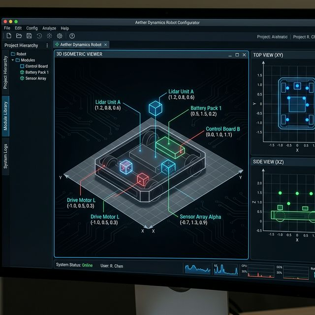

# Step 4: 安装坐标图形化交互设计文æ¡?
## 1. 视觉方案
为了彻底摆脱"纯文字框"的简陋感，我们设计了三合一渲染引擎ï¼?
### 📐 主视图：2.5D 轴侧空间 (Isometric View)
- **空间æ„?*: 采用 30° 轴侧投影，真实还原机器人的长宽高 (X/Y/Z) 空间关系ã€?- **参考系**: 
  - **红轴 (X)**: 向右前方延伸ã€?  - **绿轴 (Y)**: 向左前方延伸ã€?  - **蓝轴 (Z)**: 垂直向上ã€?- **底盘足迹**: 以半透明发光网格 (Grid) 标识机器人的理论边界ã€?
### 🖼 辅助视图ï¼?D 正交投影 (Top/Side Views)
- **俯视å›?(Top)**: 排布于主图左下角，实时反åº?X-Y 平面的点位分布ã€?- **侧视å›?(Side)**: 位于主图右下角，反应组件离地高度 (Z è½?ã€?
## 2. UI 概念å›?(Mockup)

## 3. 交互逻辑
1.  **数据绑定**: 画布直接订阅 Zustand Store çš?`components` 数组。任何坐标修改将通过 `requestAnimationFrame` 同步渲染ã€?2.  **视觉反馈**:
    - **悬停高亮**: 鼠标在侧边栏选中组件时，画布中对应的点位会产生呼吸灯特效ã€?    - **单位换算**: 保持毫米 (mm) 与像ç´?(px) 的等比缩放，支持 Auto-Fit 以适应大型机器人ã€?
