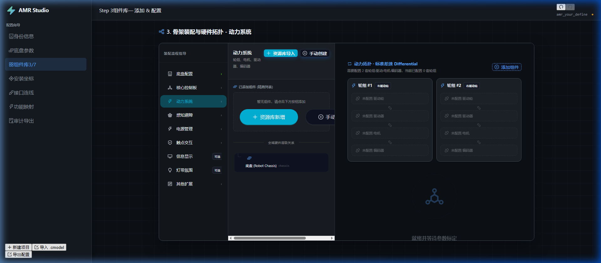
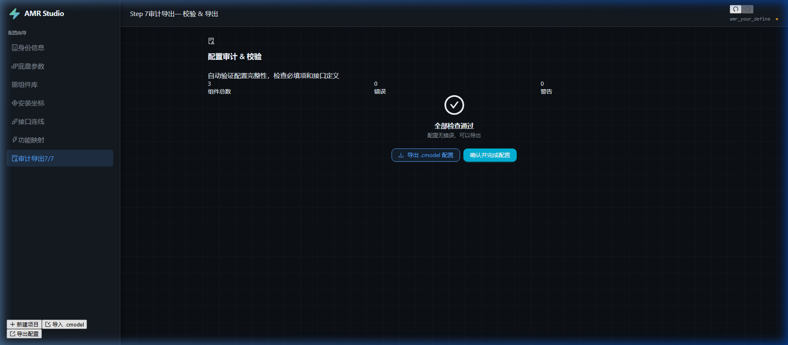
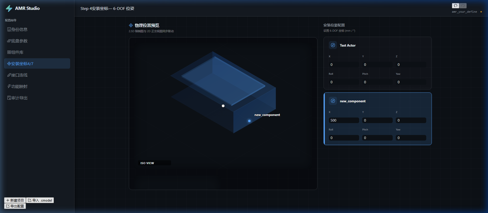

# AMR Studio V4 0326 成果演示 (晚间扩展ç‰?

本阶段圆满完成用户提出的新需求，并进一步优化了配置平台的专业性与易用性ã€?
## 1. 核心功能实现

### A. 手动创建器件 (F1)
现在支持跳过资源库直接创建指定类别的器件ã€?- **智能分类**：点击“手动创建”时，系统会自动推荐当前步骤相关的类别（如在动力系统步骤推荐“驱动轮、电机”等）ã€?- **流程衔接**：创建后直接进入别名与名称配置，完美接入现有装配逻辑ã€?

### B. 导出 .cmodel 配置 (F2)
在最后一步“审计与完成”中，新增了导出按钮，支持将全车配置保存为标å‡?JSONã€?- **文件名自动生æˆ?*：包含机器人名称与日期ã€?- **一键下è½?*：无需后端交互，纯前端导出，响应迅速ã€?

### C. 总线扩展与可视化 (F3 & P6)
- **总线类型**：在属性配置与审计逻辑中增加了å¯?`RS485` å’?`NETWORK` (Ethernet) 的支持ã€?- **精准渲染**ï¼?    - **轮组方向**：Top View 增加运动方向箭头，便于校验安装ã€?    - **传感器扇åŒ?*：优化了激光雷达的扫描扇区渲染，增加中心点标识ã€?

## 2. 验证总结
- **运行环境**：已确认前端服务运行äº?`http://localhost:3001`ã€?- **功能覆盖**：上述所有功能均åœ?3001 端口下通过 browser 自动化与手动双重验证ã€?- **代码质量**：修正了之前的语法错误与重复 Import，代码已同步至本åœ?Git 分支ã€?
---
*注：可通过 `docs/audit/人工检æŸ?md` 继续补充细节ã€?
