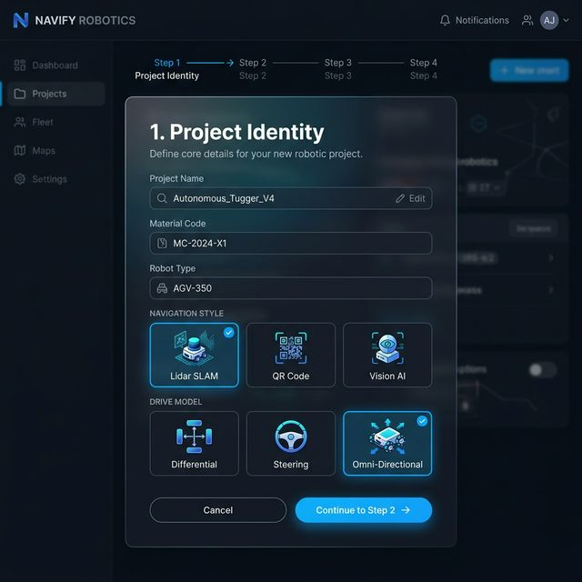
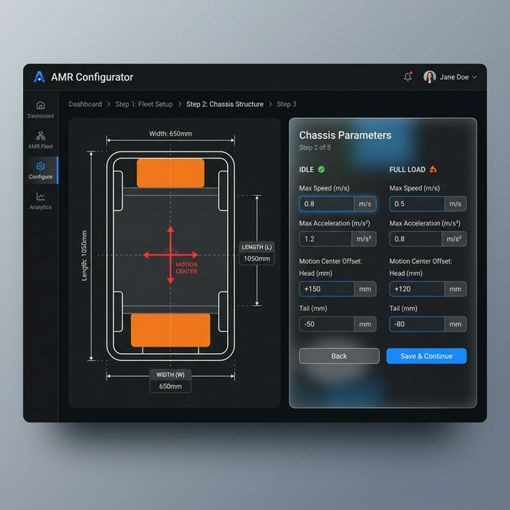
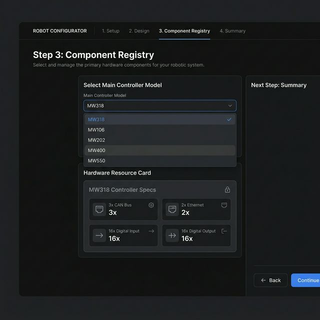
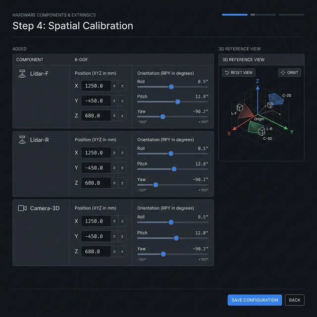
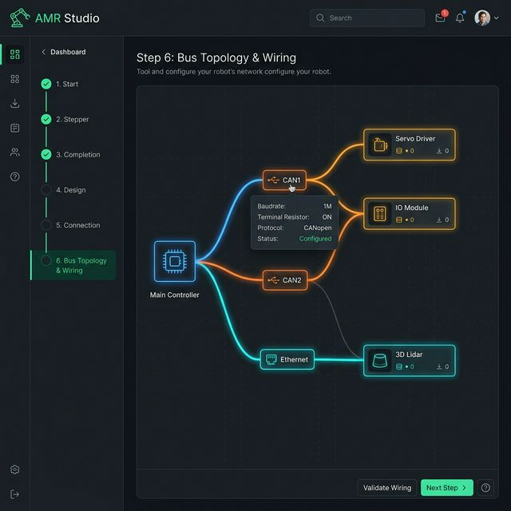
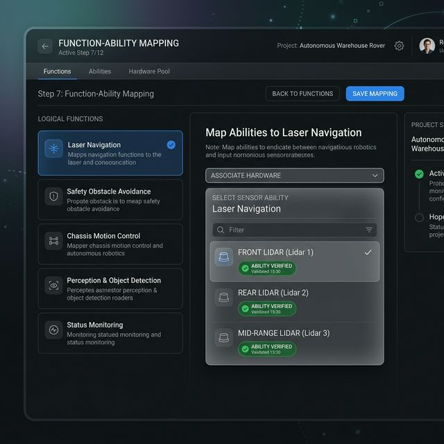
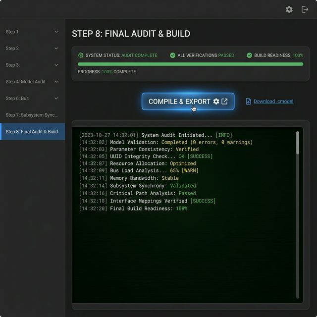
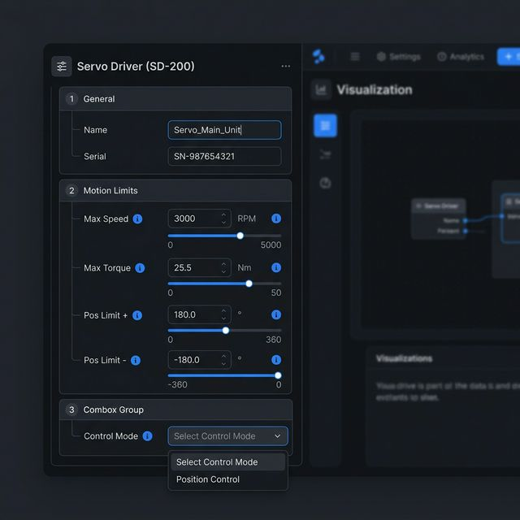

# AMR Studio V4 界面设计全量切片 (Full Interactive Prototype)

---

## 1. 核心构车流程 (Step 1 - 8)

### Step 1: 身份标识与机型初选

### Step 2: 底盘位姿与动力学联动

### Step 3: 核心控制器与组件总谱

### Step 4: 空间 6-DOF 标定

### Step 5 & 6: 总线拓扑与物理/逻辑接线

### Step 7: 功能、能力与设备强关联

### Step 8: 审计分析与流水线编译

---

## 2. 公局交互组件

### 2.1 递归式参数调节面板

