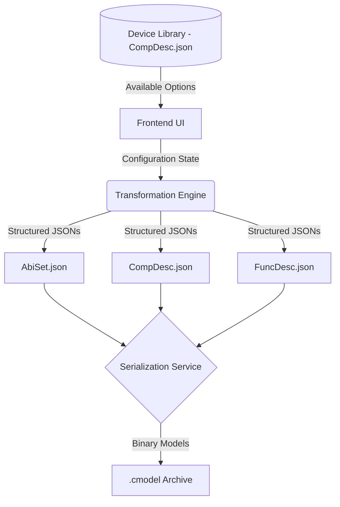

# System Design: AMR Model Configurator

## 1. Objective
Design a graphical, step-by-step configuration tool that allows engineers to assemble as AMR (Autonomous Mobile Robot) by selecting components from a verified library (parsed from existing models). The tool ensures the final output is a compliant `.cmodel` archive.

## 2. Technical Philosophy
- **Library-Driven Configuration**: The available types and models for Chassis, Boards, Drivers, etc., are strictly derived from the existing `CompDesc.json` dataset.
- **Unified Deconstruction**: The system relies on a central "Transformation Engine" that maps UI state to three standard documents: `AbiSet.json`, `CompDesc.json`, and `FuncDesc.json`.

---

## 3. High-Level Architecture

### 3.1 Component Diagram

### 3.2 Main Workflow
1.  **Library Loading**: On startup, the Backend scans the library directory, parses `CompDesc.model` using the high-precision parser, and exports a "Device Catalog".
2.  **Assembly Flow**:
    - **Step 1: Chassis Selection**: Choose base Diff/Omni chassis.
    - **Step 2: Control Hub**: Select Main Board and IO expansion modules.
    - **Step 3: Drive System**: Map drivers to wheel/motor positions.
    - **Step 4: Perception & UI**: Add Lidar, IMU, Buttons (E-Stop/Reset), and Indicators (LED).
    - **Step 5: Power System**: Select Battery and BMS modules.
    - **Step 6: Signal Routing**: Map IO signal connections (DI/DO links).
3.  **Validation**: Real-time checking of interface compatibility (e.g., IO port counts).
4.  **Export**: Trigger the reconstruction pipeline (JSON -> Binary -> Zip).

---

## 4. Design Constraints

### 4.1 Schema Compliance (The "Golden Rule")
The system MUST NOT generate any keys or structures that are not defined in the corresponding `.proto` files. All reconstruction must be verifiable against the original `systematic_serializer.py` logic.

### 4.2 Dependency Management
- **Hardware Dependencies**: Drivers require specific interface types (e.g., CAN, RS485) which must be present on the selected boards.
- **Coordinate Frames**: The system must calculate relative offsets (LocCoordX/Y/Z) based on the mounting points defined in the sub-module schemas.

### 4.3 Data Integrity
Each assembly component must retain its original `moduleUuid` (if reused from library) or generate a new unique, valid UUID to maintain traceability.

---

## 5. Expected Results
- **Seamless assembly**: Reduction of manual JSON editing errors by 90%.
- **Bit-Precise Output**: Configuration models generated by the tool should be deployable to the robot controller without any further conversion.

---
**Senior Design Engineer**: Antigravity  
**Status**: Initial Draft
