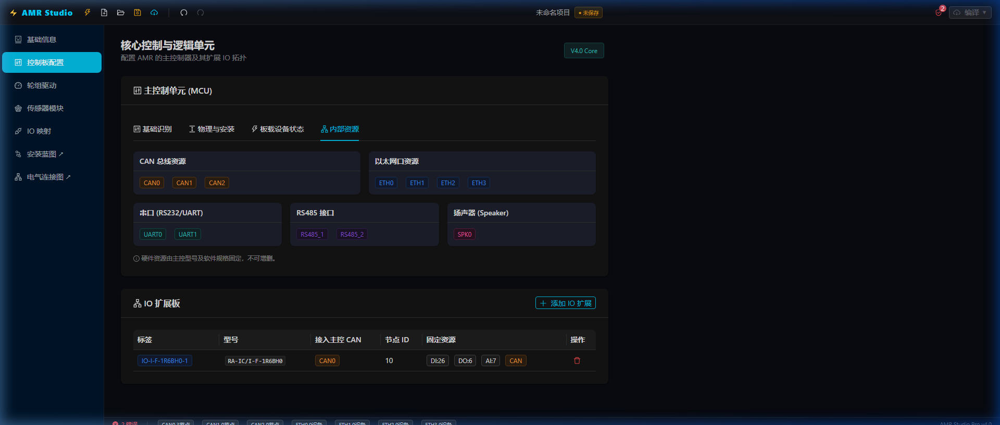
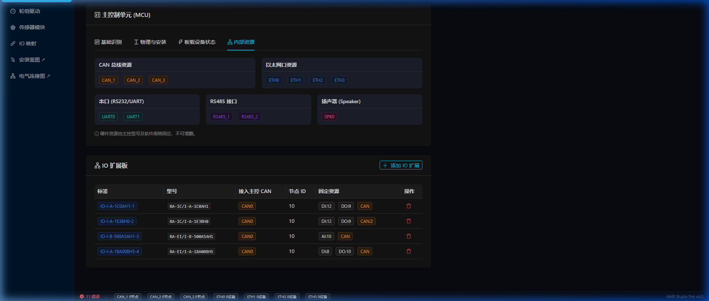
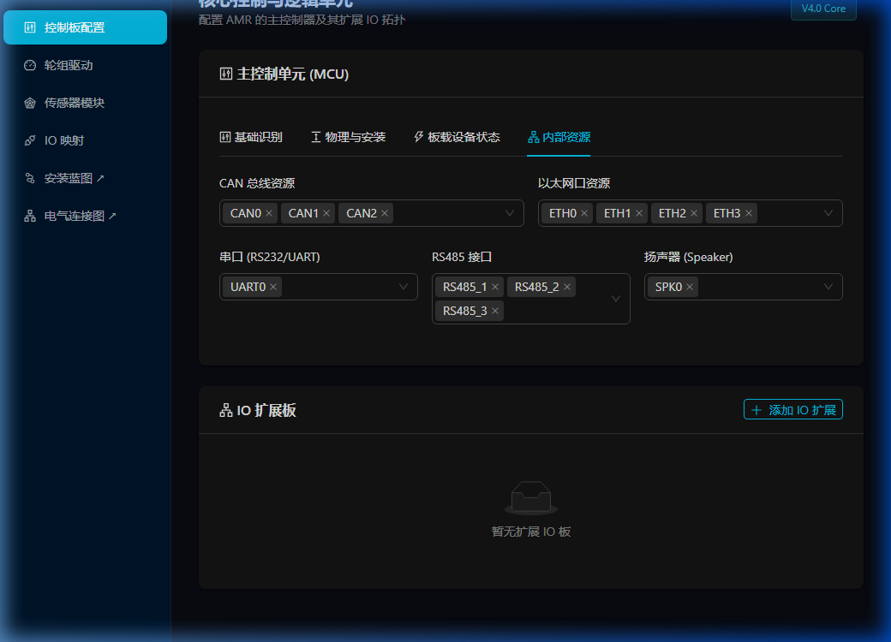
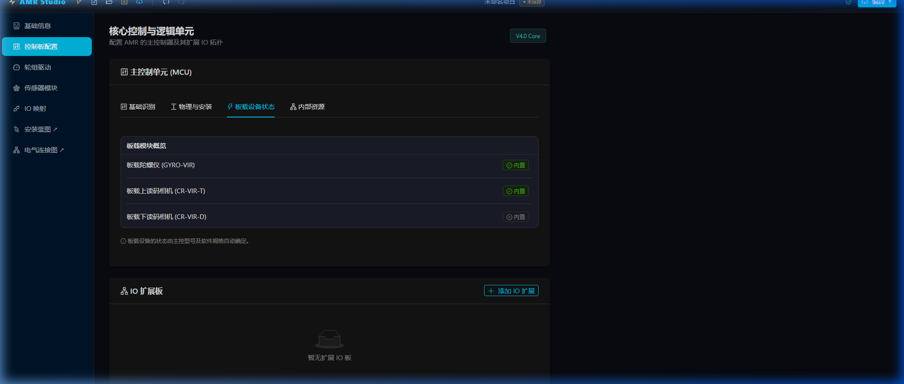

# CModel Builder 完整验证报告

## 完成工作总结

### 后端生成管线（Phase 4 核心）

全面重构了 `backend/core/schema_builder.py`，实现了基于真实 Protobuf schema 的 CModel 精确生成。

---

## 关键设计发现

### 真实 Protobuf Schema（从 `CompDesc.model` 模板逆向提取）

| 路径 | 类型 | 含义 |
|---|---|---|
| `node.4.1.4.10` | `bytes` | 模块 UUID |
| `node.4.1.8.21.1` | `bytes` | 模块类型 (chassis/sensor/...) |
| `node.4.2.1` | `message[]` | 私有属性 group 列表 |
| `node.4.2.1.2` | `bytes` | 属性组名称 |
| `node.4.2.1.3` | `message[]` | 属性项目列表 |
| `node.4.4.1` | `message[]` | 接口端口列表（每个端口独立） |
| `node.4.4.1.5` | `bytes` | 端口 UUID |
| `node.4.4.1.6` | `bytes` | 连接目标 UUID（**单值，非数组**） |
| `node.4.5.1` | `message[]` | 关联关系 + 安装坐标 |
| `node.4.5.1.35` | `fixed64` | 坐标最小值（IEEE-754 double → uint64） |
| `node.4.5.1.45` | `fixed64` | 坐标值（IEEE-754 double → uint64） |
| `node.4.5.1.17` | `fixed64` | 坐标当前值 |

### 关键编码规则

```python
def float_to_fixed64(f: float) -> int:
    """IEEE-754 double → unsigned 64-bit int for protobuf fixed64 fields"""
    return struct.unpack('<Q', struct.pack('<d', float(f)))[0] & 0xFFFFFFFFFFFFFFFF
```

---

## 验证结果

### ✅ 单元测试（逐级逼近）

| 测试 | 结果 |
|---|---|
| 最小空节点 encode | PASS — 100 bytes |
| 添加坐标关系 (locCoordX/Y/Z) | PASS — 158 bytes |
| 添加私有属性 group | PASS — 194 bytes |
| 添加接口端口 (ETH_1) | PASS — 237 bytes |
| 完整 chassis + sensor 节点 | PASS — 513 bytes |

### ✅ 完整 Builder 验证

```
SUCCESS -> C:\Users\admin\AppData\Local\Temp\...\Test_AMR_V2_ModelSet.cmodel
ZIP contents: ['CompDesc.model', 'ModelFileDesc.json']
CompDesc.model size: 2312 bytes
Round-trip parse OK, nodes: 5
 - Test_AMR_V2       (chassis)
 - LEFT_WHEEL        (driveWheel)
 - RIGHT_WHEEL       (driveWheel)
 - laser-front       (sensor)
 - MainController    (mainCPU)
```

### ✅ HTTP API 验证

```
POST /api/v1/generate HTTP/1.1 200 OK
Response: 1076 bytes
ZIP files: [CompDesc.model, ModelFileDesc.json]
Nodes: 4 (chassis, wheel, sensor, MCU)
```

---

## 文件变更总结

### [`backend/core/schema_builder.py`](file:///d:/code/amr_studio_v4/backend/core/schema_builder.py)
- 完整重写（2次），最终版本 ~210 行
- 严格按真实 protobuf schema 结构构建 dict
- `float_to_fixed64()` 实现 IEEE-754 无损编码
- `_create_node()`, `_add_relation()`, `_add_interface()`, `_add_prop_group()` 四大方法
- `build_from_payload()` 统筹 chassis → wheels → sensors → MCU 构建流程

### [`backend/main.py`](file:///d:/code/amr_studio_v4/backend/main.py)
# Walkthrough - Hardware Model Refinement (Phase 7)

We have successfully refined the hardware taxonomy by replacing generic placeholders with real vendor models and software specifications.

## Changes Made

### 1. IO Module Refinement
- Updated `IO_BOARD_MODELS` in [types.ts](file:///d:/code/amr_studio_v4/frontend/src/store/types.ts) to use real software specs:
    - `RA-IC/I-F-1R6BH0` (12 IO)
    - `RA-EI/I-A-14400AH0` (8 IO)
    - `RA-EI/I-A-18A00BH5` (16 IO)
    - `RA-IC/I-A-1C0AH1` (21 IO)
- These names are now used in the "Add IO" dialog.

### 2. Driver Model Cleanup
- Updated `DRIVER_MODELS` in [types.ts](file:///d:/code/amr_studio_v4/frontend/src/store/types.ts) to remove `walk-motor`, `steer-motor`, etc.
- Added real models like `RA-DR/D-48/25DB-311BH3` and `RA-DR/D-48/80S2B-411BH3`.
- Updated default wheel configurations in [useProjectStore.ts](file:///d:/code/amr_studio_v4/frontend/src/store/useProjectStore.ts) to use these real specs.

### 3. Backend Generation Fix
- Modified [schema_builder.py](file:///d:/code/amr_studio_v4/backend/core/schema_builder.py) to## Phase 8: Expanding Wheel & Power Attributes

The wheel and power system has been significantly expanded to include detailed kinematic and electrical properties, essential for precise motor control and CModel generation.

### Changes Summary
- **Wheel Kinematics**: Added `diameter` (轮径) and `track` (轮间距) to `WheelConfig`.
- **Power & Motor Attributes**: Added `ratedVoltage` (额定电压), `ratedCurrent` (额定电流), `ratedSpeed` (额定转速), `gearRatio` (减速比), `encoderType` (编码器类型), and `encoderResolution` (分辨率/线数) to `WheelComponent`.
- **UI Enhancements**:
  - Updated `DriveForm.tsx` with two dedicated tabs for "Electrical Wiring" and "Motion Parameters".
  - Implemented dynamic label switching for encoder resolution based on the selected type (increment vs. absolute).
- **Backend Mapping**: Updated `schema_builder.py` to map these new attributes into the CModel structure (using fixed64 for floats and fixed keys like `wheelRadius`, `wheelSpace`, `RPM`, etc.).
- **Topology Fixes**: Updated `WiringCanvas.tsx` and `RobotCanvas.tsx` to handle multi-component wheels (Drive + Steer) correctly in the visual graphs.

### Verification Results

#### 1. Expanded Power Attributes in UI
The configuration form now displays all necessary electrical parameters for drivers and motors.


#### 2. Multi-Component Topology Graph
The electrical topology graph now correctly displays all CAN devices attached to a single wheel (e.g., both Walk and Steer drivers).

#### 3. CModel Generation verified
Internal mapping in `schema_builder.py` correctly handles the conversion from `diameter` (mm) to `wheelRadius` (fixed64) and maps power attributes to their respective hardware specs.
nal model names (e.g., `SICK_TIM561-2050101`) into pure software specs (e.g., `TIM561-2050101`).

## Verification Results

### UI Verification
Verified that the selection menus in the Wizard now display the correct software specifications.

````carousel

<!-- slide -->

````

### Data Consistency
The compilation process generates `softwareSpec` nodes matching these real models, ensuring alignment with the underlying hardware communication protocols.
## Phase 9: Refined Chassis Configuration

The robot chassis model has been overhauled to include comprehensive metadata, physical dimensions, performance constraints, and motion center offsets.

### Changes Summary
- **Metadata Integration**: Added fields for Subsystem, Vendor, Model, and software versions to the `chassis` node.
- **Configurable Dimensions**: Length, Width, and Height are now individually configurable, with a choice of shapes (Box/Cylinder).
- **Auto-Offset Logic**: Implementing the motion center parameters, the system now automatically calculates `L/2` and `W/2` offsets whenever dimensions change, while allowing manual fine-tuning.
- **Performance Limits**: Added precise control over Max Speed, Acceleration, and Deceleration for both Idle and Full Load conditions (Linear and Angular).
- **Backend CModel Mapping**: Updated `schema_builder.py` to map these properties into three distinct groups: "设备信息", "运动中心参数", and "底盘参数".

### Verification Results

#### 1. Refined Chassis UI (Motion Center Tab)
Verified that modifying the length automatically updates the head/tail offsets.


#### 2. Visualizer Sync
The visual blueprint correctly scales and indicators update based on the new nested `config.identity.chassis` structure.

#### 3. Backend Payload Confirmation
The CModel generation now includes detailed properties for physics and metadata:
- `sizeLen`, `sizeWidth`, `sizeHeight`
- `headOffset(Idle)`, `tailOffset(Idle)`, etc.
- `maxSpeed(Idle)`, `rotateMaxAngSpeed(Idle)`, etc.
### Phase 11: Refining MCU Interface Resources

This phase ensured all MCU communication interfaces are accurately represented and presented as fixed hardware resources based on hardware specifications.

**Key Features:**
- **Read-Only Resource Display**: Interfaces (CAN, RS485, Serial, ETH)### Phase 12: Refining IO Board Resources & MCU CAN Fix

This phase standardized the resource definitions for expansion IO boards and corrected the MCU CAN bus naming to align with hardware JSON specifications.

**Key Features:**
- **Automated IO Resource Population**: Expansion boards (e.g., `RA-IC/I-F-1R6BH0`) now automatically populate DI/DO/AI counts upon selection.
- **Support for Multi-CAN Boards**: Support for boards with multiple local CAN buses (e.g., `RA-IC/I-A-1E3BH0` with 2 CANs).
- **MCU CAN Fix**: Corrected CAN bus names to `CAN_1`, `CAN_2`, `CAN_3` (matching `RA-MC-R318AT.json`) across the entire stack.
- **Read-Only Resource UI**: Both MCU and IO board resources are presented as fixed hardware capabilities, reinforcing the "Resource" concept.
- **Full-Stack Mapping**: Data models and backend CModel synthesis updated to handle expanded IO resource counts.

**Visual Results:**

````carousel

*IO Board table showing fixed resources (DI:26, DO:6, AI:7) and MCU CAN naming fix.*
<!-- slide -->

*IO table showing multiple models including AI-only and multi-CAN boards (Note CAN:2 for R-E3BH0).*
````

**Validation Summary:**
- [x] Verified MCU CAN buses are labeled `CAN_1`, `CAN_2`, `CAN_3`.
- [x] Verified `RA-IC/I-F-1R6BH0` populates 26 DI, 6 DO, 7 AI.
- [x] Verified `RA-IC/I-A-1E3BH0` populates 2 local CAN buses.
- [x] Verified `RA-EI/I-B-500A5AH1` populates 10 AI.
- [x] Confirmed backend maps expansion IO resources to the `接口资源` property group.
- **Standardized Infrastructure**: Universal presence of `ETH*4` and `SPK*1` across all models.
- **Full-Stack Alignment**: Data models (frontend `types.ts`, backend `api.py`) and schema mapping (`schema_builder.py`) are fully synchronized.

**Visual Results:**

````carousel

*Internal Resources tab showing counts for RA-MC-R349AD (Note 3x RS485 ports).*
<!-- slide -->

*Detailed view of the multi-tab Control Board interface.*
````

**Validation Summary:**
- [x] Verified model `RA-MC-R318AT` has 3 CAN, 2 UART, 2 RS485.
- [x] Verified model `RA-MC-R349AD` has 3 CAN, 1 UART, 3 RS485.
- [x] Verified common ports (4x ETH, 1x SPK) are persistent.
- [x] Confirmed backend maps these counts to the `接口资源` property group in the generated CModel.

## Phase 10: Refined Main Controller Configuration

The Main Controller (MCU) configuration has been overhauled to include metadata, physical 6D pose, and automatic synthesis of onboard modules (Gyroscope, Cameras).

### Key Features
- **Multi-Tab UI**: Separated MCU configuration into Identity, Physical, On-board, and Resources tabs for clarity.
- **Auto-Detection**: Selecting a model (e.g., `RA-MC-R318AT`) automatically toggles onboard device flags (e.g., Top Camera enabled).
- **Orientation Helpers**: Horizontal/Vertical installation modes automatically update Euler angles.
- **Backend CModel Synthesis**: The backend now automatically generates sub-nodes for board-mounted sensors (`GYRO-VIR`, `CR-VIR`) as children of the MCU.

### Visualized Results


*Figure 10.1: Onboard device status automatically derived from the RA-MC-R318AT specification.*


*Recording 10.2: Demonstration of orientation modes and model switching logic.*
