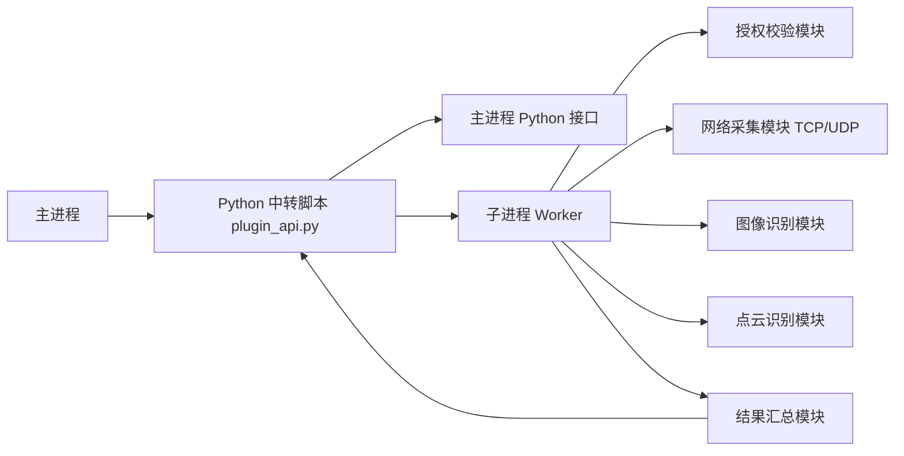
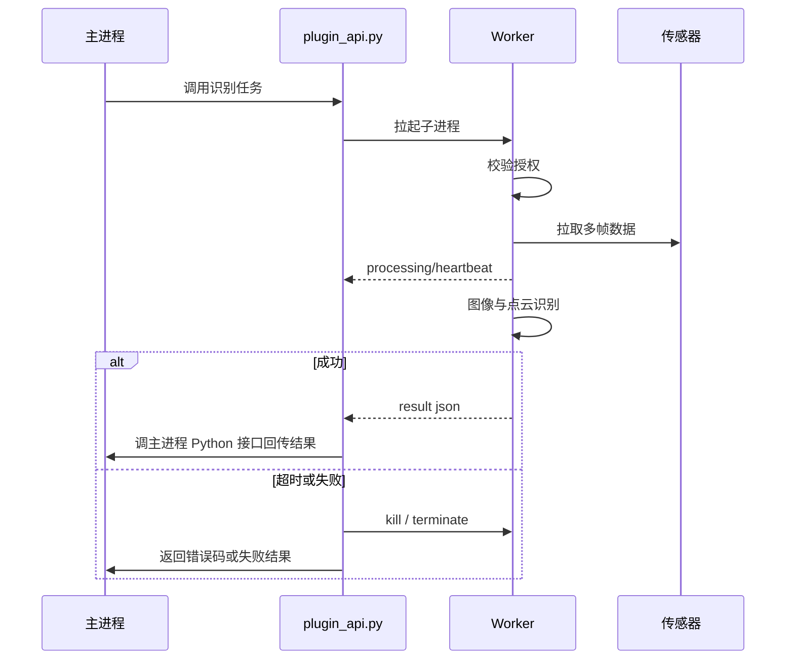
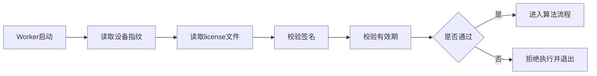

# 边缘视觉与点云识别插件
## 系统架构设计说明书

- 文档版本：V1.0
- 输出日期：2026-04-21
- 适用对象：架构师、算法工程师、平台工程师、交付工程师

## 1. 设计目标

在不了解主进程内部实现机制的前提下，设计一套安全、可控、可交付的视觉/点云识别插件架构，使其满足以下目标：

- 保持 Python 插件调用形态
- 将高风险计算隔离在独立子进程
- 对主进程零侵扰或最小侵扰
- 满足 1GB / 单核资源约束
- 支持授权与源码保护
- 支持 5 秒内确定性返回

## 2. 架构原则

### P1. 零信任主进程

不假设主进程：

- 采用子进程方式调用
- 可以配合做资源分配
- 可以接受插件崩溃
- 能容忍共享解释器风险

### P2. 高风险逻辑必须隔离

以下逻辑不允许直接运行在主进程调用链所处的 Python 解释器中：

- 点云处理
- 图像重计算
- 授权核心校验
- C/C++ 扩展调用

### P3. 对外兼容，对内编译

- 对外保留 Python 脚本入口
- 对内使用编译核心提升安全性和性能

## 3. 总体架构



## 4. 模块划分

## 4.1 `plugin_api.py`

职责：

- 提供给主进程的唯一调用入口
- 启动和管理 Worker 子进程
- 监听超时
- 获取处理状态
- 接收最终结果
- 调用主进程 Python 接口回传

特点：

- 明文脚本
- 不承载重计算
- 不直接导入高风险算法核心

## 4.2 Worker 进程

职责：

- 读取配置
- 校验授权
- 建立网络连接
- 拉取多帧图像 / 点云
- 执行识别
- 输出状态与结果

特点：

- 独立 OS 进程
- 可被熔断
- 可被单独限制资源

## 4.3 授权模块

职责：

- 读取设备指纹
- 校验 `license.lic`
- 校验有效期
- 校验签名

## 4.4 网络采集模块

职责：

- TCP/UDP 接入
- 数据缓存
- 超时重试
- 帧级缓冲

## 4.5 图像识别模块

职责：

- 图像预处理
- ROI 裁剪
- 去畸变
- 特征提取 / 匹配 / 定位
- 多帧融合

## 4.6 点云识别模块

职责：

- 点云 ROI 裁剪
- 降采样
- 特征提取
- 配准 / 定位
- 多帧融合

## 4.7 结果模块

职责：

- 汇总识别结果
- 计算置信度
- 输出 JSON
- 输出状态码

## 5. 进程边界设计

## 5.1 为什么必须使用独立子进程

如果直接在主进程可见的 Python 脚本中导入 `.so`：

- 若主进程是嵌入式 Python，崩溃可能传染到主进程
- 若 ABI 不兼容，可能造成解释器级故障
- 若内存爆掉，主进程可能一起受影响

因此建议：

- Python 外壳只作为代理
- 核心计算只在 Worker 子进程运行

## 5.2 隔离收益

- `.so` 崩溃只影响 Worker
- OOM 只影响 Worker
- 授权失败只影响 Worker
- 超时可直接 kill Worker

## 6. 时序设计



## 7. 资源控制设计

## 7.1 CPU 控制

设计原则：

- 不假设主进程愿意让出某个核
- 不盲目猜测主进程绑核策略
- 插件进程主动降权

建议策略：

- `nice +10`
- `OMP_NUM_THREADS=1`
- `OPENBLAS_NUM_THREADS=1`
- `MKL_NUM_THREADS=1`
- `cv2.setNumThreads(1)`
- 若配置中明确指定 CPU affinity，则从允许集合中绑定

### CPU 绑定策略

支持配置项：

- `cpu_affinity_enabled`
- `cpu_affinity_core`

若未配置：

- 默认不强绑
- 仅降低优先级

## 7.2 内存控制

建议策略：

- Worker 启动后立即设置 `RLIMIT_AS = 1GB`
- 单帧处理数据量必须受控
- 图像先裁剪再识别
- 点云先裁剪再降采样再识别

### 内存预算建议

| 模块 | 预算 |
| --- | --- |
| Python 解释器与基础依赖 | 150MB |
| 网络缓存 | 100MB |
| 图像缓存 | 150MB |
| 点云缓存 | 300MB |
| 算法中间结果 | 150MB |
| 系统余量 | 150MB |

## 8. 算法流水线设计

## 8.1 图像识别流水线


设计原则：

- 尽量减少全图处理
- 优先用矩阵运算而非 Python for 循环
- 多帧融合采用滑动窗口

## 8.2 点云识别流水线


设计原则：

- 坚决避免全量点云直接进识别
- 控制点数规模
- 优先增量融合而不是全量堆积

## 9. 5 秒确定性返回设计

## 9.1 内部超时

Worker 内部设置：

- `soft_timeout_ms = 4500`
- `hard_timeout_ms = 5000`

规则：

- 到 4.5s 时必须停止继续扩张计算量
- 使用当前最优结果进行收敛或降级返回

## 9.2 外部熔断

`plugin_api.py` 必须对 Worker 设置 `5s` 硬超时。

一旦超过：

- 立刻终止 Worker
- 返回标准错误
- 主进程调用链必须继续

## 9.3 返回策略

### 成功

- 有效结果
- 正常置信度

### 降级成功

- 在超时边界前返回近似结果
- 附带低置信度标志

### 失败

- 授权失败
- 网络失败
- 超时
- 内存超限
- 数据无效

## 10. 安全设计

## 10.1 代码保护

推荐：

- Python 胶水层尽量少
- 核心逻辑编译为 `.so`
- 使用 Pybind11 或 Cython
- 交付时不提供核心源码

## 10.2 授权设计

授权校验流程：



设备指纹可选：

- MAC 地址
- CPU Serial
- 板卡唯一 ID

## 11. 配置文件设计建议

示例：

```yaml
runtime:
  max_processing_time_ms: 5000
  soft_timeout_ms: 4500
  cpu_affinity_enabled: false
  cpu_affinity_core: 7
  memory_limit_mb: 1024

license:
  path: "./license.lic"
  fingerprint_type: "mac"

sensor:
  image:
    protocol: "tcp"
    host: "192.168.1.10"
    port: 9001
    frame_timeout_ms: 200
  pointcloud:
    protocol: "udp"
    host: "192.168.1.11"
    port: 9002
    frame_timeout_ms: 200

object:
  name: "target_a"
  roi:
    x: 100
    y: 80
    w: 640
    h: 480
  image_precision_mm: 3
  pointcloud_precision_mm: 10
  multi_frame_count: 5
```

## 12. 返回结果接口建议

```json
{
  "status": "success",
  "task_id": "task_001",
  "object_id": "target_a",
  "x": 123.4,
  "y": 52.1,
  "z": 18.7,
  "yaw": 91.2,
  "confidence": 0.93,
  "elapsed_ms": 4120,
  "message": "ok"
}
```

失败示例：

```json
{
  "status": "timeout",
  "task_id": "task_001",
  "object_id": "target_a",
  "confidence": 0.0,
  "elapsed_ms": 5000,
  "message": "worker timeout"
}
```

## 13. 错误码建议

| 错误码 | 含义 |
| --- | --- |
| `E1001` | 授权文件不存在 |
| `E1002` | 授权签名非法 |
| `E1003` | 授权已过期 |
| `E2001` | 图像网络连接失败 |
| `E2002` | 点云网络连接失败 |
| `E2003` | 数据帧超时 |
| `E3001` | 图像识别失败 |
| `E3002` | 点云识别失败 |
| `E4001` | Worker 超时 |
| `E4002` | Worker 内存超限 |
| `E5001` | 未知内部异常 |

## 14. 目录结构建议

```text
plugin_package/
├── plugin_api.py
├── config.yaml
├── license.lic
├── engine/
│   ├── core_executor.py
│   ├── algo_core.so
│   ├── auth_core.so
│   └── runtime/
└── logs/
```

## 15. 测试建议

### 15.1 功能测试

- 图像识别正确性
- 点云识别正确性
- 配置文件切换有效性
- license 生效

### 15.2 稳定性测试

- 连续调用 1000 次
- 网络抖动
- 授权失效
- 子进程崩溃恢复

### 15.3 性能测试

- 单次识别耗时
- 内存峰值
- CPU 单核占用
- 5 秒边界稳定性

### 15.4 集成测试

- 与主进程 Python 接口对接
- 在主进程存在绑核策略下运行
- 主进程高负载情况下插件降权验证

## 16. 结论

在主进程不可控、资源极端受限、并且必须保持 Python 插件形态的前提下，最安全的设计路径是：

- 主进程只调用轻量 Python 外壳
- 外壳拉起独立 Worker
- Worker 内部完成授权、采集、识别与输出
- 核心算法编译为二进制模块
- 使用进程边界与资源边界隔离风险

这套设计兼顾了：

- 安全性
- 可交付性
- 可维护性
- 资源可控性
- 与未知主进程机制的兼容性

