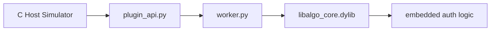

# 授权与编译核心验证方案

## 1. 目标

本方案验证以下机制：

- 主进程为 C 程序
- 主进程通过嵌入 Python 调用插件入口
- 插件与 Worker 通过正式 IPC 契约通信
- 授权校验不依赖 Python 外围逻辑，而是内聚在编译态算法库内部
- 算法逻辑以编译动态库方式运行，避免以 Python 源码直接暴露

## 2. 核心原则

如果未授权，则算法跑不起来。

因此授权校验必须满足：

- 不是“单独调一个授权库，成功后再自由调算法库”
- 而是“算法库自己的对外执行接口，在内部检查授权状态”
- 未授权时，算法步骤接口和终态接口都直接拒绝执行

## 3. 验证链路



说明：

- `plugin_api.py` 只负责下发 license path、设备指纹、产品名、功能位
- `worker.py` 只通过 `ctypes` 调用 `libalgo_core.dylib`
- `libalgo_core.dylib` 内部链接授权逻辑，维护授权状态
- 授权失败时，Worker 只能发出 `task.auth.failed` 和最终 `task.error`

## 4. 事件协议

本次增加授权阶段事件：

- `task.auth.valid`
- `task.auth.failed`

这样主进程可以明确区分：

- Worker 是否已经启动
- 任务是否已被接收
- 是否通过授权
- 是否进入实际算法执行

## 5. 资源与接口机制

资源契约保持由主进程或配置统一下发：

- CPU 上限
- 线程数限制
- 内存限制
- IO 并发限制

授权接口输入：

```json
{
  "product": "edge_vision_plugin",
  "required_feature": "algo_basic",
  "device_fingerprint": "MOCK-RK3588-EDGE-0001",
  "license_path": "./licenses/license_valid.json",
  "algorithm_library_path": "./native/build/libalgo_core.dylib"
}
```

## 6. 预期验证结果

### 6.1 success

- 收到 `task.auth.valid`
- 收到若干 `task.progress`
- 最终收到 `task.result`

### 6.2 fail

- 收到 `task.auth.valid`
- 收到部分 `task.progress`
- 最终收到 `task.error`

### 6.3 timeout

- 收到 `task.auth.valid`
- Worker 持续处理
- 插件壳超时熔断并返回 `status=timeout`

### 6.4 license_invalid

- 收到 `task.auth.failed`
- 不应收到任何 `task.progress`
- 最终收到 `task.error`
- 错误码应为 `E1002`

## 7. 结论

这套机制满足“授权与算法不可拆绕”的最低验证目标：

- 外层 Python 不拥有最终放行权
- 算法库本身决定是否允许执行
- 即使不单独调用授权库，直接调算法库接口，也仍然会因为内部授权状态未建立而失败
