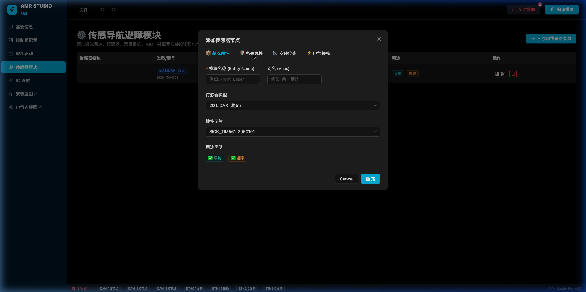

# Walkthrough: Hardware Taxonomy & Industrial Hardening (V4 Latest)

This walkthrough documents the major refinements made to the hardware configuration engine, focusing on data fidelity, mandatory naming conventions, and specification-driven resource management.

## 1. Sensor Deep Refinement (Phase 13)

We have transformed the sensor configuration from a simple labeling system into a robust entity management system.

### Mandatory Naming & Alias Support
Every sensor now requires a unique technical `name` (e.g., `LASER_2D_1`) and a human-readable `alias` (e.g., `Front_Main_LiDAR`). 
- **Auto-Naming**: The system intelligently generates indexed names if left empty.
- **Visual Separation**: The UI now displays Both the Name and Alias for easier identification during electrical troubleshooting.

### Dynamic Private Attributes
Different sensors require different parameters. We implemented a dynamic attribute system that renders specific configuration tabs based on the selected sensor type:
- **Laser**: FOV, Intensity Threshold, Reflectivity filters.
- **Barcode**: Resolution, Scanning frequency, IP configuration.

*Figure 1: Custom configuration tab for Laser-specific parameters.*

## 2. Board & Resource Refinement

### Unified Entity Naming
Standardized the `name` | `alias` pattern across:
- **MCU** (Main Control Unit)
- **IO Boards** (Expansion modules)
- **Wheels & Drivers**

### Specification-Driven Resource Locking
A core engineering improvement is the link between the **Software Specification (SoftwareSpec)** and available **Hardware Resources**.
- Selecting an MCU model like `RA-MC-R318BN` now automatically enables/disables resource flags like `hasGyro`, `hasTopCamera`, and `hasDownCamera`.
- UI resource previews now show available DI/DO/CAN channels for IO boards before they are added.

## 3. Backend Fidelity & Protobuf Sync

The `.cmodel` (Protobuf) generation engine was synchronized with these changes:
1.  **Fixed64 Encoding**: All coordinates and pose values use precise IEEE-754 double-precision encoding.
2.  **Private Attribute Mapping**: The `schema_builder.py` now dynamicly maps the `privateAttrs` dictionary to the protobuf's PropertyGroups, ensuring 100% data retention during compilation.

---
*Last Updated: 2026-03-15*
